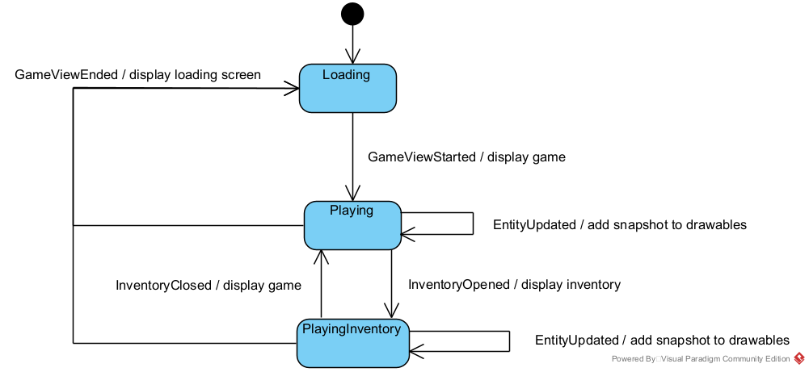

# RGB: Архитектурная документация

**Авторы:** Денис Лочмелис, Глеб Соловьев

## Общие сведения о системе

RGB &mdash; rogue-like игра с тайловой 2D-графикой.

### Геймплей

Пользователь управляет главным персонажем &mdash; разноцветным квадратом.
В реальном времени на плоской карте появляются враги, атакующие персонажа.
Персонаж же в реальном времени автоматически производит атаки, пользователь ими не управляет.

**Цель игры:** выживать как можно дольше / достичь условия победы (например, набрать достаточный уровень опыта),
уничтожая врагов и уклоняясь от их атак.

**Основная механика:** вид атак персонажа и врагов зависит от цветов ячеек, из которых эти сущности состоят.
Например: красная ячейка позволяет атаковать огненными атаками, синяя &mdash; водными.

## Architectural drivers

### Функциональные требования

- Игра в стиле Roguelike:
    - Нет сохранений
    - Игровой мир представляет собой набор тайловых 2D-уровней
    - Персонажа можно кастомизировать (в т. ч. при помощи различных игровых предметов)
- Игровые события, возникающие независимо от действий игрока: появление, перемещение и действия мобов;
  появление предметов и т. д.

### Нефункциональные требования

- Расширяемость: в ближайшем будущем ожидаются новые функциональные требования
- Поддерживаемость: сделать изменение кодовой базы проекта простым и понятным для новых разработчиков
- Гибкость системы: иметь возможность добавлять различные новые игровые механики, неразработанные заранее

### Технические требования

- Кроссплатформенность: Linux, Windows, MacOS
- Использование готовых игровых движков запрещено

### Границы системы

- Игра для одного игрока, офлайн
- Вид сверху
- *Простая* 2D графика: не планируем использовать Unreal Engine
- Десктопное приложение: не планируем поддерживать мобильные устройства

## Роли и случаи использования

### Игрок

- Скачивает и запускает приложение
- Выбирает стартовые параметры игры
- Начинает игру
- Управляет перемещением персонажа
- Перезапускает игру

### Разработчик расширений игры

- Скачивает исходный код приложения
- Создает новые игровые уровни, новых врагов, новые виды атак, поведений и т. д.
- Предлагает изменения в оригинальный проект

## Основная архитектура системы

### Идеи-драйверы

При выборе архитектуры мы руководствовались следующими глобальными идеями.

1. Взаимодействие игровых сущностей &mdash; **многопоточно**. Действительно, многопоточное приложение сложнее и дольше
   разрабатывать, тестировать. Однако многопоточное взаимодействие сущностей:
    * лучше соответствует предметной области &mdash; настоящие сущности в реальном мире осуществляют жизнедеятельность
      параллельно; такое соответствие улучшит опыт игрока, в том числе за счет недетерминированности;
    * более эффективно задействует вычислительные ресурсы по сравнению с однопоточной версией &mdash; например,
      несколько ядер.

2. Различные по природе действия игровых сущностей **не должны быть жестко связаны моментом исполнения**. Другими
   словами,
   периодическое обновление сущности, в котором будут синхронно проходить как действия движения, так и действия
   атаки (и другие) &mdash; неподходящее нам решение, так как оно сильно ограничивает контроль над скоростью и гибкостью
   выполнения сущностью различных действий.

3. Действия пользователя поступают в систему **асинхронно**, реагировать на них необходимо как можно оперативнее. То
   есть
   предметной области игры уже соответствует некоторая врожденная асинхронность, которую можно естественно
   распространить и на остальные части системы.

### Архитектурный стиль: event-driven система

Благодаря этим идеям-драйверам мы остановились на **event-driven архитектуре** &mdash; как на многопоточном асинхронном
и гибком решении. В таком случае игровые сущности представляют собой некоторые объекты, которые исполняются параллельно
и могут взаимодействовать посредством обмена сообщений. Безусловный плюс такого подхода в более простой и
надежной реализации многопоточности, в которой каждая отдельная сущность _однопоточно_ обрабатывает поступающие ей
сообщения, вся же коммуникация между потоками организуется посылкой сообщений.

При этом у игры так или иначе есть общие разделяемые ресурсы, состояние: например, точка входа пользовательских команд,
конфигурация и сценарий уровня, состояние приложения (загрузка / игра / меню и т. д.); кроме того, какой-то код должен
отвечать за контроль жизненного цикла всех компонент (создать, запустить, контролировать, завершить, очистить ресурсы).
Наконец, важной задачей являлось по максимуму избежать дублирования кода, отвечающего за повторяемую между сущностями
логику &mdash; соответственно, ее тоже было решено вынести в отдельные доступные всем блоки. Таким образом,
необходимы отдельные компоненты, отвечающие за общие ресурсы и общую логику &mdash; некоторые _сервисы_.

### Особенность: движки

Однако классическая версия event-driven архитектуры &mdash; с общей шиной сообщений и сервисами, получающими из нее
необходимые данные &mdash; нам не подошла.

* Если сущности будут осуществлять свои действия, получать необходимую информацию для принятия решений из сервисов с
  помощью сообщений &mdash; то логика сущностей окажется страшно _мелко дробленной_. То есть, в таком случае вместо
  синхронного вызова необходимого метода логики сущности необходимо отправить сообщение сервису, после чего перейти в
  состояние ожидания ответа (так как блокирующе ждать нельзя, сущность зависнет), в котором уже дождаться ответа и
  продолжить изначально задуманный сценарий действий. Понятное дело, что такой подход потенциально ведет к огромному
  числу состояний и сложной организации мелко дробленной логики.
* Проблемы с _атомарностью действий_. За счет того, что моменты запроса и получения информации сущностью не совпадают,
  между ними могут быть обработаны другие события. Что, конечно, ведет к необходимости предусматривать огромное число
  тонкостей при разработке сущностей.

Именно поэтому мы решили использовать следующую вариацию event-driven архитектуры: взаимодействие с компонентами общей
логики происходит не посредством сообщений, а вызовом методов соответствующих разделяемых всеми объектов. Эти объекты, в
свою очередь, должны быть потокобезопасными. Далее они будут называться **движками или Engine-ами**. Каждый будет
инкапсулировать общую логику, связанную с определенной системой: физического взаимодействия объектов, боевки, создания и
уничтожения сущностей и т. д.

### Особенность: отдельные каналы вместо общей шины

Еще одним недостатком классической event-driven архитектуры для нас стала организация _работы с общей шиной_.

* Прежде всего в нашей игре общая шина не реализует своего главного свойства: в
  нашей системе нет и не предвидится большого числа событий, на которые необходимо реагировать большому числу компонент;
  чаще всего у сообщения известен адресат: одна сущность столкнулась с другой (адресаты &mdash; две сущности),
  пользователь нажал на кнопку управления героем (адресат &mdash; сущность героя), изменилось отображение объекта (
  адресат &mdash; компонент отображения).
* При этом в случае известных адресатов и их небольшого числа отправлять сообщения определенным компонентам &mdash;
  банально производительнее, общая шина не станет потенциальным узким местом.
* Наконец, реализация: эффективные реализации общей шины предоставляют различные брокеры, однако взаимодействие с ними
  &mdash; межпроцессное, что может оказаться сильно менее эффективным, по сравнению с работой исключительно в плоскости
  потоков и корутин.

Именно поэтому мы остановились на следующем решении: у каждой компоненты, которая хочет получать сообщения (в будущем
абстрактный класс `Messagable`), есть **своя очередь сообщений** &mdash; **канал**; для отправки сообщения необходимо
задать канал адресата. При этом каждый владелец канала последовательно обрабатывает поступающие в последний сообщения.

### Особенность: unit-ы и владение свойствами сущности

Весь игровой мир &mdash; тайловый, задается тайлами согласно предметной области. Поэтому естественно, чтобы
взаимодействие между сущностями основывалось на тайлах. Соответственно, каждой игровой сущности соответствует
собственный _набор тайлов с различными свойствами_: расположением на карте, цветом (определяющим атаку и отрисовку),
количеством очков здоровья и т. д. При этом различным движкам актуальны различные свойства, присущие тайлам сущности.
Например, физике, очевидно, необходимо знать расположение сущности и других объектов на карте; боевке &mdash; цвета,
определяющие типы атак; компоненте отображения &mdash; цвета и формы, в которых необходимо сущность отрисовывать.

Таким образом, встает вопрос о владении данными, описывающие свойства тайлов сущностей. Мы выбирали из двух естественных
вариантов.

1. Каждый движок поддерживает свою копию тайлов сущности, однако только с нужными ему свойствами. Основной плюс: многие
   свойства оказываются инкапсулированы в соответствующие движки, логическое разделение данных лучше. Однако некоторые
   свойства необходимы нескольким движкам, например, тот же цвет. В том числе, самой сущности в момент принятия решений
   может понадобиться знать свои параметры. Отсюда получается дублирование данных между компонентами &mdash; что
   приводит к разрастанию кода и потенциальным проблемам согласованности данных (при копировании и изменении), с
   чем необходимо бороться.
2. Все свойства одного тайла сущности хранятся в **unit-е**, простом data-объекте. При этом за владение собственными
   unit-ами каждая сущность ответственна сама, что само по себе соответствует предметной области (в реальном мире
   сущности ответственны за свои части). Самое же главное, unit &mdash; это понятная всем компонентам признанная
   валюта. Безусловно, тогда каждый движок имеет доступ ко всей информации о тайле сущности, даже к ненужной ему,
   однако взамен пропадают описанные в прошлом варианте проблемы.

В соответствии с требованием о поддерживаемости кода мы выбрали второй вариант, как более лаконичный в реализации и
понятный идейно.

Уточнение насчет изменения unit-ов разными компонентами (возможно, из разных потоков). Такое изменение &mdash;
запрещено. За изменение определенных свойств отвечает конкретный движок: например, за изменение позиции unit-а на карте
&mdash; физика; за количество его очков здоровья и цвет &mdash; система боя. При этом другим компонентам разрешено
свободно читать свойства unit-ов: консистентность с изменениями в других потоках обеспечивается блокировками (писатель
делает изменения под блокировками) или готовыми потокобезопасными обертками вроде `AtomicReference`.

## Язык программирования

Для реализации выбранной архитектуры мы выбрали язык программирования `Kotlin`: за одну из самых удобных и эффективных
реализаций корутин (что важно при реализации эффективной многопоточной асинхронности), удобный синтаксис, совместимость
с большим числом `JVM` библиотек и актуальность в современном мире. Также неплохую производительность, что необходимо
при реализации большого приложения-игры.

## Архитектура

Пока что в некоторых разделах далее не хватает чистового словесного описания &mdash; оно появится скоро. Временно можно
обратиться к: [черновым заметкам по архитектуре
в Google Docs](https://docs.google.com/document/d/1pXdBGHG9x2S0aqMznwd_aHe34v4Hf89sVMB4F51Wtmw/edit?usp=sharing).

## Компоненты системы

На диаграмме изображены основные компоненты системы.

* `Messaging` &mdash; модуль отвечающий за систему сообщений: предоставление каналов (очередей сообщений), корутины их
  обработчиков, различных подклассов `Message`-ей (сообщений).
* `Entities` &mdash; пакет, включающий составляющие базовый класс игровой сущности `Entity` компоненты и ее различных
  наследников.
* `View` &mdash; модуль классов, отвечающих за отображение игровой графики и обработку пользовательского ввода.
* `Controller` &mdash; компонент, осуществляющий управление приложением (загрузку и завершение игры, переключение
  уровней) и предоставляющий доступ к хранимым разделяемым объектам `Engine`-ов, `View`, чтобы другие компоненты могли с
  ними взаимодействовать.
* `Engines` &mdash; набор игровых движков, т. е. потокобезопасных классов, инкапсулирующих и предоставляющих общую
  логику для сущностей. На данный момент движков 6:
    * `Physics` &mdash; механизмы физического взаимодействия объектов и расположение их в игровом мире;
    * `Fighting` &mdash; логика нанесения урона, действий и взаимодействий цветов (обновление, изменение), подробнее см.
      в разделе далее;
    * `Creation` &mdash; функционал по созданию сущностей в игровом мире и удалению их из него;
    * `Behaviour` &mdash; движок, отвечающий за накладывание эффектов на сущности (например, эффекта горения, заморозки
      и т. д.); название `Behaviour` связано с реализацией эффектов, подробнее см. в соответствующем разделе;
    * `Items` &mdash; самый простой движок, позволяющий сущности подбирать предмет или, наоборот, выбрасывать его в мир;
    * `Experience` &mdash; механизмы хранения и обновления очков и уровней игрового опыта, запуску определенных действий
      по достижению уровней.

Соответственно, наследники `Entity`, `Controller` и реализации `View` каждые имеют свои каналы сообщений и
соответствующие корутины-обработчики, предоставляемые `Messaging`. `Egines` же используются сущностями для совершения
тех или иных действий в игре, являются потокобезопасными объектами и не имеют каналов и корутин для обмена
сообщениями. `Controller` же их создает и хранит, а также использует для создания и удаления сущностей из игрового мира
при изменении игрового уровня (речь про `Creation`).

## Messaging: система сообщений и многопоточность компонент

### Message и Messagable

Класс сообщений &mdash; пустой `Message`, имеющий большое число подвидов-наследников (`CollidedWith`, `UserMoved`
, `EntityUpdated` и другие). Основной же класс модуля &mdash; абстрактный `Messagable`, содержащий очередь для
получения сообщений (встроенный в `Kotlin` `Channel`) и предоставляющий методы:

* `receive(m: Message)` &mdash; можно вызвать у любого `Messagable`, чтобы отправить ему сообщение `m`;
* `messagingRoutine()` &mdash; корутина, обрабатывающая сообщения канала;
* `handleMessage(m: Message)` &mdash; абстрактный метод, в котором наследнику необходимо реализовать логику обработки
  сообщений.

Соответственно, чтобы дать возможность заданному классу получать и обрабатывать сообщения, достаточно отнаследовать его
от `Messagable` и реализовать `handleMessage`.

### Tick и Ticker-ы

Кроме того, есть отдельный вид сообщений (тоже с большим количеством наследников) &mdash; `Tick`-и. Это пустые сообщения
без данных, которые компоненты посылают сами себе с определенным периодом, чтобы регулярно совершать те или иные
действия. Например, сущности, которые хотят передвигаться, периодично посылают себе `MoveTick`-и и при их получении
совершают одно движение.

За реализацию объектов, автоматически посылающих `Tick`-и, отвечает класс `Ticker`. Создается он от заданного периода в
миллисекундах, с которым необходимо слать `Tick`-и; `Messagable` цели, адресату `Tick`-ов; объекта `Tick`-а (который
будет отправляться); и опционально `scope`-а его корутины. Основными методами являются функции `start` и `stop`,
отвечающие соответственно за запуск и остановки корутины, отправляющей сообщения.

Соответственно, чтобы задать какое-либо периодичное действие определенному компоненту, достаточно завести в нем
соответствующие `Ticker`-ы и запустить их.

## GameEntity: представление и логика сущности

`GameEntity` &mdash; абстрактный базовый класс любой игровой сущности. Его цель &mdash; задать набор необходимых для
всех сущностей компонент, при этом оставив максимально гибкие возможности по их настройке. При этом, конечно, `Entity`
является наследником класса `Messagable`, то есть умеет получать сообщения и должна реализовать
метод `handleMessage(m: Message)` для их обработки.

### GameUnit-ы

Как описывалось выше, каждая сущность владеет набором своих `unit`-ов &mdash; поле `units: MutableSet<GameUnit>`,
где `GameUnit` &mdash; как раз класс, соответствующий одному `unit`-у. Множество является изменяемым, так как сущности
разрешено менять набор своих `unit`-ов во время игры (например, при смерти одного `unit`-а весь герой (`Hero`) не умрет)
; при этом оно потокобезопасно &mdash; чтобы данные о `unit`-ах было консистентно читать из других потоков.

Сами же `GameUnit`-ы являются абстрактным классом с данными:

* `parent: GameEntity` &mdash; обратная ссылка на родительскую сущность, необходима для возможности отправить сообщение
  обладателю `unit`-а (например, при коллизии двух `unit`-ов в физике необходимо разослать соответствующим
  сущностям `CollidedWith`).
* `gameColor: RGB` &mdash; цвет `unit`-а; согласно основной механике нашей игры он задается в формате RGB и влияет не
  только на отображение, но и на тип и урон атак.
* `cell: Cell` &mdash; координаты `unit`-а в игровом мире; игровой мир &mdash; плоская 2D-сетка тайлов, поэтому
  достаточно хранить координаты по двум осям.
* `lastMoveDir: Direction` &mdash; последнее направление, по которому двигался `unit`. Его несложно поддерживать в
  соответствующем движке (физики), при этом параметр оказался полезным для задания передвижения многих цветовых
  эффектов (т. е., например, траектории различных снарядов).

Абстрактность класса проявляется в двух его наследниках: `HpGameUnit` и `NoHpGameUnit`. В соответствии с названиями,
первая версия хранит очки здоровья `unit`-а, а вторая &mdash; нет. Подобные классы позволяют лучше типизировать `unit`
-ы, у которых логически нет здоровья &mdash; например, у `unit`-ов обычных стен, они бессмертны.

### Компоненты врожденных свойств

У игровых сущностей большое количество описывающих их свойств: начиная от набора `unit`-ов (описывающих положение, цвета
и очки здоровья) и заканчивая определенными физическими, боевыми и другим свойствами (например, является ли сущность
физически непроходимой, какие из ее `unit`-ов активны, как они отображаются и так далее). При этом естественно хранить
их в самих сущностях, такой ООП стиль наиболее соответствует предметной области (в реальной жизни объекты ответственны
за свои компоненты и свойства). Однако, очевидно, что такое большое количество несгруппированных параметров внутри
одного класса превратится в кашу. Именно поэтому мы решили применить
паттерн [Component](https://gameprogrammingpatterns.com/component.html): `Entity` состоит из определенных компонент,
каждая из которых отвечает за определенный набор ее свойств. А именно.

* `ViewEntity` &mdash; задает отрисовку `unit`-ов сущности (то есть то, как сущность будет выглядеть в графике).
    * В абстрактном методе `convertUnit(unit: GameUnit): ViewUnit` как раз необходимо реализовать алгоритм, задающий это
      отображение. Например, в случае многоклеточных мобов-боссов `unit`-ы головы и тела могут отрисовываться
      по-разному.
    * Метод `applyMessageToAppearance(m: Message)` может менять отображение `unit`-ов в зависимости от полученных
      сообщений. Например, реализация по умолчанию меняет цвет границы `unit-ов` при получении сообщений о накладывании
      / снятии эффектов (например, в случае горения она становится красной). В случае же сущности героя (`Hero`) метод
      реагирует на сообщения об изменении очков здоровья &mdash; и чем здоровье становится ниже, тем более мелким
      рисует `unit`-ы героя.
    * Финальный метод `takeViewSnapshot(): GameEntityViewSnapshot` &mdash; он выполняет снимок `unit`-ов сущности,
      который затем `View` использует для ее отображения.
* `PhysicalEntity` &mdash; задает физические и связанные с передвижением свойства сущности.
    * Абстрактное поле `isSolid: Boolean` описывает &laquo;физическую непроходимость&raquo; сущности, то есть могут ли
      другие сущности через нее проходить. Например, через стены (`Wall`) проходить нельзя. Чтобы разрешить определенным
      сущностям нарушать эти правила (например, чтобы добавить призраков), достаточно добавить в `PhysicalEntity` еще
      одно поле &laquo;физической прозрачности&raquo;.
    * Абстрактный метод `getUnitDirection(unit: GameUnit, dir: Direction): Direction` определяет алгоритм
      передвижения `unit`-ов сущности, где `dir` &mdash; направление, в котором хочет подвинуться сущность. Например, в
      случае сущности-змеи голова задает движение, а `unit`-ы тела сдвигаются на место идущего перед ними `unit`-а.
      Кроме того, реализовать данный метод можно с помощью `NoDirection`, тем самым на уровне врожденного свойства
      запретив сущности двигаться.
    * Метод `filterIncompatibleUnits(units: Set<GameUnit>): Set<GameUnit>` оставляет в наборе только те сущности, с
      которыми данная не может находиться на одной клетке. Данный метод пригодился мобу `Glitch`, которому разрешено
      создаваться на любой клетке, где еще нет другого `Glitch`. Реализация по умолчанию же запрещает находиться на
      одном тайле с `isSolid` сущностей.
* `FightEntity` &mdash; задает боевые свойства сущности.
    * Абстрактное поле `teamId: Int` соответствует номеру команды сущности &mdash; система боевки использует его, чтобы
      сущности из одной команды не наносили урона друг другу, а из разных &mdash; не совершали лечение.
    * Абстрактный метод `isUnitActive(unit: GameUnit): Boolean` задает активность переданного `unit`-а сущности. Под
      активностью понимается разрешение цвету данного `unit`-а совершать соответствующие ему действия: например,
      красному цвету пускать огненные шары, синему &mdash; волны. Возвращать `false` может понадобиться, например, в
      случае `unit`-ов стен.
* `BehaviorEntity` &mdash; фабрика мета-поведений, подробнее см. в разделе про `Behaviour`. Если вкратце: мета-поведения
  позволяют налету модифицировать поведение сущности (паттерн декоратор) определенным образом;
  например, `ConfusedBehaviour` &mdash; заставляет сущность двигаться в случайные направления. Однако некоторым
  сущностям необходимо модифицировать накладывание тех или иных поведений, например, `ConfusedBehaviour` для
  героя (`Hero`) инвертирует управления игрока. Чтобы выполнить такую модификацию, необходимо и достаточно
  переопределить метод фабрики `BehaviourEntity` (в данном
  случае `createConfusedBehaviour(childBehaviour: Behaviour): Behaviour`). `SingleBehaviourEntity` &mdash; лишь
  альтернативная версия, которая запрещает накладывать какие-либо мета-поведения, всегда возвращая одно заданное
  поведение по умолчанию.
* `ExperienceEntity` &mdash; задает число опыта, которое получит герой (в будущем &mdash; убийца) за смерть сущности.
    * Абстрактное поле `onDieExperiencePoints: Int?`, задающее описанное выше число очков опыта.

Таким образом, различные `XxxEntity` компоненты описывают различные группы врожденных свойств сущности. При реализации
конкретных наследников `Entity` эти компоненты можно и нужно реализовывать, что обеспечивает гибкость и удобство.

### Lifecycle

Обработка сообщений у каждой сущности, конечно, зачастую особенная &mdash; просто потому, что именно обработка сообщений
и задает поведение сущности. Однако у всех `Entity` есть общий и обязательный блок логики обработки сообщений,
отвечающий за их жизненный цикл и модификацию поведений во время игры. Он реализован в классе `Lifecycle`;
каждая `Entity` хранит свой `Lifecycle` в соответствующем поле `lifecycle`.

Его главный и единственный публичный метод &mdash; `handleMessage(message: Message)` &mdash; реализует описанную выше
общую логику жизнедеятельности сущностей, именно к этому методу напрямую делегируется `handleMessage(m: Message)`
класса `Entity`. При этом у `Lifecycle` есть еще два поля: `entity: GameEntity` &mdash; ссылка на сущность-родителя
(потребуется для модификации поведения, см. далее); и `childBehaviour: Behaviour` &mdash; текущее поведение сущности,
именно ему делегируется большая часть сообщений, поступающих на обработку в `Entity`.

`Lifecycle` внутри себя реализует следующий конечный автомат, соответствующий жизненному циклу любой сущности.

У сущности есть три состояния: `NotStarted`, `Ongoing` и `Dead`.

* `NotStarted`: объект сущности создан, но пока не начал жить. Например, при загрузке уровня сначала
  все объекты сущностей создаются, после чего все помещаются в мир и только затем, наконец, запускаются посылкой
  сообщений `LifeStarted`. Данный механизм нужен для корректности запуска игрового уровня: если запускать каждую
  сущность сразу после ее расположения на карте, то, возможно, одну из следующих уже не получится разместить на
  запланированном месте.

  При этом пока сущность находится в состоянии `LifeStarted` ей уже начнут приходить сообщения &mdash; например, другие
  сущности начали с ней сталкиваться (когда ее расположили в игровом мире). Те из них, которые наследуют
  класс `SaveInNotStartedAndReplayInOngoingMessage`, `Lifecycle` сохраняет в очередь, после чего при переходе в
  состояние активной игры пересылает их сущности дальше на обработку. Таким образом, имеющие смысл сообщения в начале
  игры не теряются &mdash; некоторые могут быть важными и не возникнуть вновь (например, `CollidedWith` с `Item`-ом в
  случае `Glitch`-и).

* `Ongoing`: сущность существует в игровом мире и полноценно функционирует. В таком состоянии все сообщения, кроме
  управляющих, делегируются `childBehaviour`, который задает текущее поведение сущности (т. е. обработчик сообщений).
  Управляющими сообщениями же являются, во-первых, `RemoveBehaviour` и `ApplyBehaviour`, с помощью которых
  осуществляется механизм навешивания или удаления мета-поведений во время игры (подробнее см. в соответствующем
  разделе); во-вторых, `LifeEnded` &mdash; сообщение о завершении жизни сущности, по которому автомат переходит в
  терминальное состояние.
* `Dead`: сущность мертва и никогда больше не оживет. Все сообщения игнорируются &mdash; они еще могут приходить от
  адресатов, знающих ссылку данной сущности.

Наконец, у `Entity` есть два метода: `onLifeStart()` и `onLifeEnd()`, их вызывает `Lifecycle` в соответствии с
указанными выше автоматом. В них, например, некоторые сущности могут подписываться на сообщения от определенных
компонент или соответственно отписываться от них. Конкретный пример &mdash; герой: ему необходимо подписаться на события
о вводе пользователя во `View`.

### Создание новых сущностей

Небольшой итог. Чтобы создать новую сущность, необходимо отнаследовать ее от класса `Entity` и:

* реализовать компоненты `XxxEntity`, тем самым определив врожденные свойства сущности;
* создать `Lifecycle`: для этого потребуется определить его исходный `childBehaviour`, то есть задать поведение сущности
  &mdash; здесь поможет удобный `BehaviourBuilder`, подробнее это будет обсуждено в разделе про поведения.

## View: отображение игры и считывание ввода

## Controller: управление состоянием приложения

TODO

## Система боя: FightEngine и update цветов

TODO

## Создание и удаление сущностей: CreationEngine

TODO

## Поведения и эффекты: стратегии мобов, Lifecycle и BehaviourEngine

## Предметы: Item, ItemsEngine, Inventory

## Система опыта: ExperienceEngine

TODO

## Загрузка и генерация уровней: различные Loader-ы и фабрики

## Будущие возможности

Безграничны и прекрасны!

[//]: # (## Секретная секция: тигоны и лигры)
