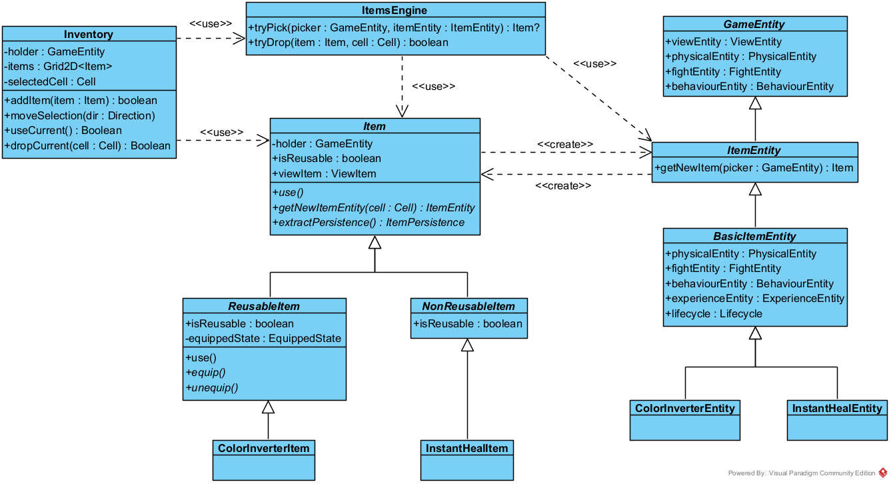

# RGB: Архитектурная документация

**Авторы:** Денис Лочмелис, Глеб Соловьев

## Общие сведения о системе

RGB &mdash; rogue-like игра с тайловой 2D-графикой.

### Геймплей

Пользователь управляет главным персонажем &mdash; разноцветным квадратом.
В реальном времени на плоской карте появляются враги, атакующие персонажа.
Персонаж же в реальном времени автоматически производит атаки, пользователь ими не управляет.

**Цель игры:** выживать как можно дольше / достичь условия победы (например, набрать достаточный уровень опыта),
уничтожая врагов и уклоняясь от их атак.

**Основная механика:** вид атак персонажа и врагов зависит от цветов ячеек, из которых эти сущности состоят.
Например: красная ячейка позволяет атаковать огненными атаками, синяя &mdash; водными.

## Architectural drivers

### Функциональные требования

- Игра в стиле Roguelike:
    - Нет сохранений
    - Игровой мир представляет собой набор тайловых 2D-уровней
    - Персонажа можно кастомизировать (в т. ч. при помощи различных игровых предметов)
- Игровые события, возникающие независимо от действий игрока: появление, перемещение и действия мобов;
  появление предметов и т. д.

### Нефункциональные требования

- Расширяемость: в ближайшем будущем ожидаются новые функциональные требования
- Поддерживаемость: сделать изменение кодовой базы проекта простым и понятным для новых разработчиков
- Гибкость системы: иметь возможность добавлять различные новые игровые механики, неразработанные заранее

### Технические требования

- Кроссплатформенность: Linux, Windows, MacOS
- Использование готовых игровых движков запрещено

### Границы системы

- Игра для одного игрока, офлайн
- Вид сверху
- *Простая* 2D графика: не планируем использовать Unreal Engine
- Десктопное приложение: не планируем поддерживать мобильные устройства

## Роли и случаи использования

### Игрок

- Скачивает и запускает приложение
- Выбирает стартовые параметры игры
- Начинает игру
- Управляет перемещением персонажа
- Перезапускает игру

### Разработчик расширений игры

- Скачивает исходный код приложения
- Создает новые игровые уровни, новых врагов, новые виды атак, поведений и т. д.
- Предлагает изменения в оригинальный проект

## Основная архитектура системы

### Идеи-драйверы

При выборе архитектуры мы руководствовались следующими глобальными идеями.

1. Взаимодействие игровых сущностей &mdash; **многопоточно**. Действительно, многопоточное приложение сложнее и дольше
   разрабатывать, тестировать. Однако многопоточное взаимодействие сущностей:
    * лучше соответствует предметной области &mdash; настоящие сущности в реальном мире осуществляют жизнедеятельность
      параллельно; такое соответствие улучшит опыт игрока, в том числе за счет недетерминированности;
    * более эффективно задействует вычислительные ресурсы по сравнению с однопоточной версией &mdash; например,
      несколько ядер.

2. Различные по природе действия игровых сущностей **не должны быть жестко связаны моментом исполнения**. Другими
   словами,
   периодическое обновление сущности, в котором будут синхронно проходить как действия движения, так и действия
   атаки (и другие) &mdash; неподходящее нам решение, так как оно сильно ограничивает контроль над скоростью и гибкостью
   выполнения сущностью различных действий.

3. Действия пользователя поступают в систему **асинхронно**, реагировать на них необходимо как можно оперативнее. То
   есть
   предметной области игры уже соответствует некоторая врожденная асинхронность, которую можно естественно
   распространить и на остальные части системы.

### Архитектурный стиль: event-driven система

Благодаря этим идеям-драйверам мы остановились на **event-driven архитектуре** &mdash; как на многопоточном асинхронном
и гибком решении. В таком случае игровые сущности представляют собой некоторые объекты, которые исполняются параллельно
и могут взаимодействовать посредством обмена сообщений. Безусловный плюс такого подхода в более простой и
надежной реализации многопоточности, в которой каждая отдельная сущность _однопоточно_ обрабатывает поступающие ей
сообщения, вся же коммуникация между потоками организуется посылкой сообщений.

При этом у игры так или иначе есть общие разделяемые ресурсы, состояние: например, точка входа пользовательских команд,
конфигурация и сценарий уровня, состояние приложения (загрузка / игра / меню и т. д.); кроме того, какой-то код должен
отвечать за контроль жизненного цикла всех компонент (создать, запустить, контролировать, завершить, очистить ресурсы).
Наконец, важной задачей являлось по максимуму избежать дублирования кода, отвечающего за повторяемую между сущностями
логику &mdash; соответственно, ее тоже было решено вынести в отдельные доступные всем блоки. Таким образом,
необходимы отдельные компоненты, отвечающие за общие ресурсы и общую логику &mdash; некоторые _сервисы_.

### Особенность: движки

Однако классическая версия event-driven архитектуры &mdash; с общей шиной сообщений и сервисами, получающими из нее
необходимые данные &mdash; нам не подошла.

* Если сущности будут осуществлять свои действия, получать необходимую информацию для принятия решений из сервисов с
  помощью сообщений &mdash; то логика сущностей окажется страшно _мелко дробленной_. То есть, в таком случае вместо
  синхронного вызова необходимого метода логики сущности необходимо отправить сообщение сервису, после чего перейти в
  состояние ожидания ответа (так как блокирующе ждать нельзя, сущность зависнет), в котором уже дождаться ответа и
  продолжить изначально задуманный сценарий действий. Понятное дело, что такой подход потенциально ведет к огромному
  числу состояний и сложной организации мелко дробленной логики.
* Проблемы с _атомарностью действий_. За счет того, что моменты запроса и получения информации сущностью не совпадают,
  между ними могут быть обработаны другие события. Что, конечно, ведет к необходимости предусматривать огромное число
  тонкостей при разработке сущностей.

Именно поэтому мы решили использовать следующую вариацию event-driven архитектуры: взаимодействие с компонентами общей
логики происходит не посредством сообщений, а вызовом методов соответствующих разделяемых всеми объектов. Эти объекты, в
свою очередь, должны быть потокобезопасными. Далее они будут называться **движками или Engine-ами**. Каждый будет
инкапсулировать общую логику, связанную с определенной системой: физического взаимодействия объектов, боевки, создания и
уничтожения сущностей и т. д.

### Особенность: отдельные каналы вместо общей шины

Еще одним недостатком классической event-driven архитектуры для нас стала организация _работы с общей шиной_.

* Прежде всего в нашей игре общая шина не реализует своего главного свойства: в
  нашей системе нет и не предвидится большого числа событий, на которые необходимо реагировать большому числу компонент;
  чаще всего у сообщения известен адресат: одна сущность столкнулась с другой (адресаты &mdash; две сущности),
  пользователь нажал на кнопку управления героем (адресат &mdash; сущность героя), изменилось отображение объекта (
  адресат &mdash; компонент отображения).
* При этом в случае известных адресатов и их небольшого числа отправлять сообщения определенным компонентам &mdash;
  банально производительнее, общая шина не станет потенциальным узким местом.
* Наконец, реализация: эффективные реализации общей шины предоставляют различные брокеры, однако взаимодействие с ними
  &mdash; межпроцессное, что может оказаться сильно менее эффективным, по сравнению с работой исключительно в плоскости
  потоков и корутин.

Именно поэтому мы остановились на следующем решении: у каждой компоненты, которая хочет получать сообщения (в будущем
абстрактный класс `Messagable`), есть **своя очередь сообщений** &mdash; **канал**; для отправки сообщения необходимо
задать канал адресата. При этом каждый владелец канала последовательно обрабатывает поступающие в последний сообщения.

### Особенность: unit-ы и владение свойствами сущности

Весь игровой мир &mdash; тайловый, задается тайлами согласно предметной области. Поэтому естественно, чтобы
взаимодействие между сущностями основывалось на тайлах. Соответственно, каждой игровой сущности соответствует
собственный _набор тайлов с различными свойствами_: расположением на карте, цветом (определяющим атаку и отрисовку),
количеством очков здоровья и т. д. При этом различным движкам актуальны различные свойства, присущие тайлам сущности.
Например, физике, очевидно, необходимо знать расположение сущности и других объектов на карте; боевке &mdash; цвета,
определяющие типы атак; компоненте отображения &mdash; цвета и формы, в которых необходимо сущность отрисовывать.

Таким образом, встает вопрос о владении данными, описывающие свойства тайлов сущностей. Мы выбирали из двух естественных
вариантов.

1. Каждый движок поддерживает свою копию тайлов сущности, однако только с нужными ему свойствами. Основной плюс: многие
   свойства оказываются инкапсулированы в соответствующие движки, логическое разделение данных лучше. Однако некоторые
   свойства необходимы нескольким движкам, например, тот же цвет. В том числе, самой сущности в момент принятия решений
   может понадобиться знать свои параметры. Отсюда получается дублирование данных между компонентами &mdash; что
   приводит к разрастанию кода и потенциальным проблемам согласованности данных (при копировании и изменении), с
   чем необходимо бороться.
2. Все свойства одного тайла сущности хранятся в **unit-е**, простом data-объекте. При этом за владение собственными
   unit-ами каждая сущность ответственна сама, что само по себе соответствует предметной области (в реальном мире
   сущности ответственны за свои части). Самое же главное, unit &mdash; это понятная всем компонентам признанная
   валюта. Безусловно, тогда каждый движок имеет доступ ко всей информации о тайле сущности, даже к ненужной ему,
   однако взамен пропадают описанные в прошлом варианте проблемы.

В соответствии с требованием о поддерживаемости кода мы выбрали второй вариант, как более лаконичный в реализации и
понятный идейно.

Уточнение насчет изменения unit-ов разными компонентами (возможно, из разных потоков). Такое изменение &mdash;
запрещено. За изменение определенных свойств отвечает конкретный движок: например, за изменение позиции unit-а на карте
&mdash; физика; за количество его очков здоровья и цвет &mdash; система боя. При этом другим компонентам разрешено
свободно читать свойства unit-ов: консистентность с изменениями в других потоках обеспечивается блокировками (писатель
делает изменения под блокировками) или готовыми потокобезопасными обертками вроде `AtomicReference`.

## Архитектура

Пока что в некоторых разделах далее не хватает чистового словесного описания &mdash; оно появится скоро. Временно можно
обратиться к: [черновым заметкам по архитектуре
в Google Docs](https://docs.google.com/document/d/1pXdBGHG9x2S0aqMznwd_aHe34v4Hf89sVMB4F51Wtmw/edit?usp=sharing).

## Компоненты системы

## Messaging: система сообщений и многопоточность компонент

TODO

## GameEntity: представление и логика сущности

## View: отображение игры и считывание ввода

## Controller: управление состоянием приложения

TODO

## Система боя: FightEngine и update цветов

TODO

## Создание и удаление сущностей: CreationEngine

TODO

## Поведения и эффекты: стратегии мобов, Lifecycle и BehaviourEngine

## Предметы: Item, ItemsEngine, Inventory

## Система опыта: ExperienceEngine

TODO

## Загрузка и генерация уровней: различные Loader-ы и фабрики

## Будущие возможности

Безграничны и прекрасны!

[//]: # (## Секретная секция: тигоны и лигры)
