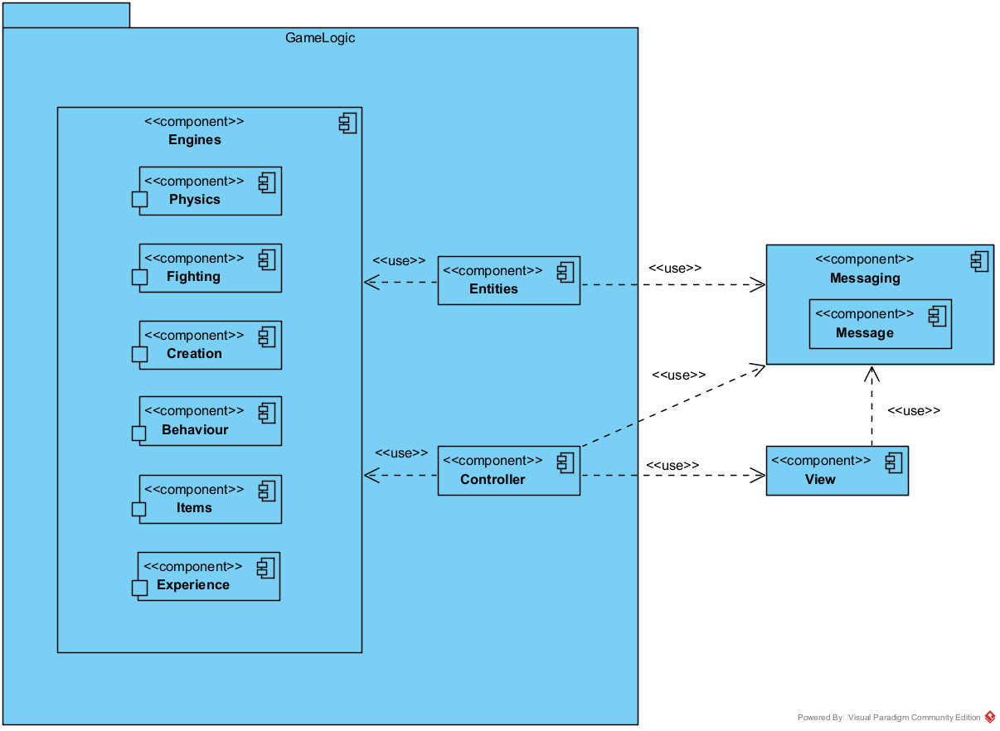
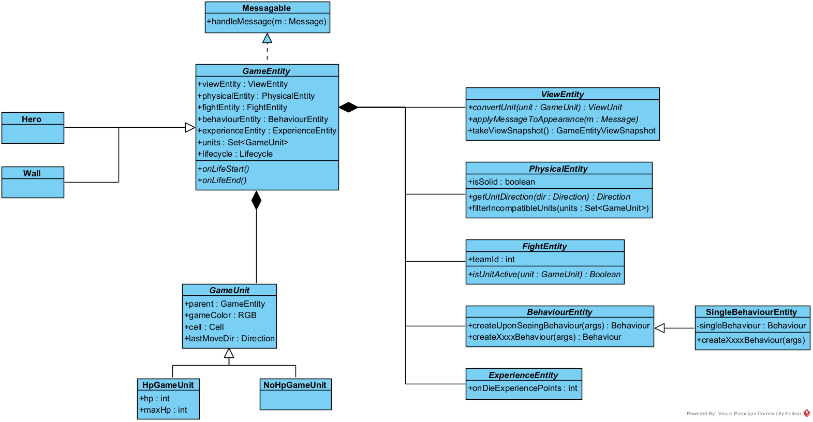
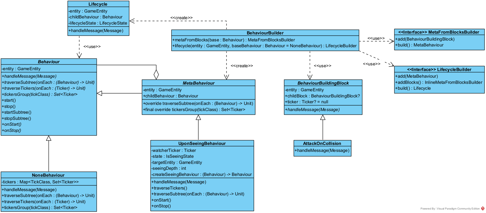

# RGB: Архитектурная документация

**Авторы:** Денис Лочмелис, Глеб Соловьев

## Общие сведения о системе

RGB &mdash; rogue-like игра с тайловой 2D-графикой.

### Геймплей

Пользователь управляет главным персонажем &mdash; разноцветным квадратом.
В реальном времени на плоской карте появляются враги, атакующие персонажа.
Персонаж же в реальном времени автоматически производит атаки, пользователь ими не управляет.

**Цель игры:** выживать как можно дольше / достичь условия победы (например, набрать достаточный уровень опыта),
уничтожая врагов и уклоняясь от их атак.

**Основная механика:** вид атак персонажа и врагов зависит от цветов ячеек, из которых эти сущности состоят.
Например: красная ячейка позволяет атаковать огненными атаками, синяя &mdash; водными.

## Architectural drivers

### Функциональные требования

- Игра в стиле Roguelike:
    - Нет сохранений
    - Игровой мир представляет собой набор тайловых 2D-уровней
    - Персонажа можно кастомизировать (в т. ч. при помощи различных игровых предметов)
- Игровые события, возникающие независимо от действий игрока: появление, перемещение и действия мобов;
  появление предметов и т. д.

### Нефункциональные требования

- Расширяемость: в ближайшем будущем ожидаются новые функциональные требования
- Поддерживаемость: сделать изменение кодовой базы проекта простым и понятным для новых разработчиков
- Гибкость системы: иметь возможность добавлять различные новые игровые механики, неразработанные заранее

### Технические требования

- Кроссплатформенность: Linux, Windows, MacOS
- Использование готовых игровых движков запрещено

### Границы системы

- Игра для одного игрока, офлайн
- Вид сверху
- *Простая* 2D графика: не планируем использовать Unreal Engine
- Десктопное приложение: не планируем поддерживать мобильные устройства

## Роли и случаи использования

### Игрок

- Скачивает и запускает приложение
- Выбирает стартовые параметры игры
- Начинает игру
- Управляет перемещением персонажа
- Перезапускает игру

### Разработчик расширений игры

- Скачивает исходный код приложения
- Создает новые игровые уровни, новых врагов, новые виды атак, поведений и т. д.
- Предлагает изменения в оригинальный проект

## Основная архитектура системы

### Идеи-драйверы

При выборе архитектуры мы руководствовались следующими глобальными идеями.

1. Взаимодействие игровых сущностей &mdash; **многопоточно**. Действительно, многопоточное приложение сложнее и дольше
   разрабатывать, тестировать. Однако многопоточное взаимодействие сущностей:
    * лучше соответствует предметной области &mdash; настоящие сущности в реальном мире осуществляют жизнедеятельность
      параллельно; такое соответствие улучшит опыт игрока, в том числе за счет недетерминированности;
    * более эффективно задействует вычислительные ресурсы по сравнению с однопоточной версией &mdash; например,
      несколько ядер.

2. Различные по природе действия игровых сущностей **не должны быть жестко связаны моментом исполнения**. Другими
   словами,
   периодическое обновление сущности, в котором будут синхронно проходить как действия движения, так и действия
   атаки (и другие) &mdash; неподходящее нам решение, так как оно сильно ограничивает контроль над скоростью и гибкостью
   выполнения сущностью различных действий.

3. Действия пользователя поступают в систему **асинхронно**, реагировать на них необходимо как можно оперативнее. То
   есть
   предметной области игры уже соответствует некоторая врожденная асинхронность, которую можно естественно
   распространить и на остальные части системы.

### Архитектурный стиль: event-driven система

Благодаря этим идеям-драйверам мы остановились на **event-driven архитектуре** &mdash; как на многопоточном асинхронном
и гибком решении. В таком случае игровые сущности представляют собой некоторые объекты, которые исполняются параллельно
и могут взаимодействовать посредством обмена сообщений. Безусловный плюс такого подхода в более простой и
надежной реализации многопоточности, в которой каждая отдельная сущность _однопоточно_ обрабатывает поступающие ей
сообщения, вся же коммуникация между потоками организуется посылкой сообщений.

При этом у игры так или иначе есть общие разделяемые ресурсы, состояние: например, точка входа пользовательских команд,
конфигурация и сценарий уровня, состояние приложения (загрузка / игра / меню и т. д.); кроме того, какой-то код должен
отвечать за контроль жизненного цикла всех компонент (создать, запустить, контролировать, завершить, очистить ресурсы).
Наконец, важной задачей являлось по максимуму избежать дублирования кода, отвечающего за повторяемую между сущностями
логику &mdash; соответственно, ее тоже было решено вынести в отдельные доступные всем блоки. Таким образом,
необходимы отдельные компоненты, отвечающие за общие ресурсы и общую логику &mdash; некоторые _сервисы_.

### Особенность: движки

Однако классическая версия event-driven архитектуры &mdash; с общей шиной сообщений и сервисами, получающими из нее
необходимые данные &mdash; нам не подошла.

* Если сущности будут осуществлять свои действия, получать необходимую информацию для принятия решений из сервисов с
  помощью сообщений &mdash; то логика сущностей окажется страшно _мелко дробленной_. То есть, в таком случае вместо
  синхронного вызова необходимого метода логики сущности необходимо отправить сообщение сервису, после чего перейти в
  состояние ожидания ответа (так как блокирующе ждать нельзя, сущность зависнет), в котором уже дождаться ответа и
  продолжить изначально задуманный сценарий действий. Понятное дело, что такой подход потенциально ведет к огромному
  числу состояний и сложной организации мелко дробленной логики.
* Проблемы с _атомарностью действий_. За счет того, что моменты запроса и получения информации сущностью не совпадают,
  между ними могут быть обработаны другие события. Что, конечно, ведет к необходимости предусматривать огромное число
  тонкостей при разработке сущностей.

Именно поэтому мы решили использовать следующую вариацию event-driven архитектуры: взаимодействие с компонентами общей
логики происходит не посредством сообщений, а вызовом методов соответствующих разделяемых всеми объектов. Эти объекты, в
свою очередь, должны быть потокобезопасными. Далее они будут называться **движками или Engine-ами**. Каждый будет
инкапсулировать общую логику, связанную с определенной системой: физического взаимодействия объектов, боевки, создания и
уничтожения сущностей и т. д.

### Особенность: отдельные каналы вместо общей шины

Еще одним недостатком классической event-driven архитектуры для нас стала организация _работы с общей шиной_.

* Прежде всего в нашей игре общая шина не реализует своего главного свойства: в
  нашей системе нет и не предвидится большого числа событий, на которые необходимо реагировать большому числу компонент;
  чаще всего у сообщения известен адресат: одна сущность столкнулась с другой (адресаты &mdash; две сущности),
  пользователь нажал на кнопку управления героем (адресат &mdash; сущность героя), изменилось отображение объекта (
  адресат &mdash; компонент отображения).
* При этом в случае известных адресатов и их небольшого числа отправлять сообщения определенным компонентам &mdash;
  банально производительнее, общая шина не станет потенциальным узким местом.
* Наконец, реализация: эффективные реализации общей шины предоставляют различные брокеры, однако взаимодействие с ними
  &mdash; межпроцессное, что может оказаться сильно менее эффективным, по сравнению с работой исключительно в плоскости
  потоков и корутин.

Именно поэтому мы остановились на следующем решении: у каждой компоненты, которая хочет получать сообщения (в будущем
абстрактный класс `Messagable`), есть **своя очередь сообщений** &mdash; **канал**; для отправки сообщения необходимо
задать канал адресата. При этом каждый владелец канала последовательно обрабатывает поступающие в последний сообщения.

### Особенность: unit-ы и владение свойствами сущности

Весь игровой мир &mdash; тайловый, задается тайлами согласно предметной области. Поэтому естественно, чтобы
взаимодействие между сущностями основывалось на тайлах. Соответственно, каждой игровой сущности соответствует
собственный _набор тайлов с различными свойствами_: расположением на карте, цветом (определяющим атаку и отрисовку),
количеством очков здоровья и т. д. При этом различным движкам актуальны различные свойства, присущие тайлам сущности.
Например, физике, очевидно, необходимо знать расположение сущности и других объектов на карте; боевке &mdash; цвета,
определяющие типы атак; компоненте отображения &mdash; цвета и формы, в которых необходимо сущность отрисовывать.

Таким образом, встает вопрос о владении данными, описывающие свойства тайлов сущностей. Мы выбирали из двух естественных
вариантов.

1. Каждый движок поддерживает свою копию тайлов сущности, однако только с нужными ему свойствами. Основной плюс: многие
   свойства оказываются инкапсулированы в соответствующие движки, логическое разделение данных лучше. Однако некоторые
   свойства необходимы нескольким движкам, например, тот же цвет. В том числе, самой сущности в момент принятия решений
   может понадобиться знать свои параметры. Отсюда получается дублирование данных между компонентами &mdash; что
   приводит к разрастанию кода и потенциальным проблемам согласованности данных (при копировании и изменении), с
   чем необходимо бороться.
2. Все свойства одного тайла сущности хранятся в **unit-е**, простом data-объекте. При этом за владение собственными
   unit-ами каждая сущность ответственна сама, что само по себе соответствует предметной области (в реальном мире
   сущности ответственны за свои части). Самое же главное, unit &mdash; это понятная всем компонентам признанная
   валюта. Безусловно, тогда каждый движок имеет доступ ко всей информации о тайле сущности, даже к ненужной ему,
   однако взамен пропадают описанные в прошлом варианте проблемы.

В соответствии с требованием о поддерживаемости кода мы выбрали второй вариант, как более лаконичный в реализации и
понятный идейно.

Уточнение насчет изменения unit-ов разными компонентами (возможно, из разных потоков). Такое изменение &mdash;
запрещено. За изменение определенных свойств отвечает конкретный движок: например, за изменение позиции unit-а на карте
&mdash; физика; за количество его очков здоровья и цвет &mdash; система боя. При этом другим компонентам разрешено
свободно читать свойства unit-ов: консистентность с изменениями в других потоках обеспечивается блокировками (писатель
делает изменения под блокировками) или готовыми потокобезопасными обертками вроде `AtomicReference`.

## Язык программирования

Для реализации выбранной архитектуры мы выбрали язык программирования `Kotlin`: за одну из самых удобных и эффективных
реализаций корутин (что важно при реализации эффективной многопоточной асинхронности), удобный синтаксис, совместимость
с большим числом `JVM` библиотек и актуальность в современном мире. Также неплохую производительность, что необходимо
при реализации большого приложения-игры.

## Архитектура

Пока что в некоторых разделах далее не хватает чистового словесного описания &mdash; оно появится скоро. Временно можно
обратиться к: [черновым заметкам по архитектуре
в Google Docs](https://docs.google.com/document/d/1pXdBGHG9x2S0aqMznwd_aHe34v4Hf89sVMB4F51Wtmw/edit?usp=sharing).

## Компоненты системы

На диаграмме изображены основные компоненты системы.

* `Messaging` &mdash; модуль отвечающий за систему сообщений: предоставление каналов (очередей сообщений), корутины их
  обработчиков, различных подклассов `Message`-ей (сообщений).
* `Entities` &mdash; пакет, включающий составляющие базовый класс игровой сущности `Entity` компоненты и ее различных
  наследников.
* `View` &mdash; модуль классов, отвечающих за отображение игровой графики и обработку пользовательского ввода.
* `Controller` &mdash; компонент, осуществляющий управление приложением (загрузку и завершение игры, переключение
  уровней) и предоставляющий доступ к хранимым разделяемым объектам `Engine`-ов, `View`, чтобы другие компоненты могли с
  ними взаимодействовать.
* `Engines` &mdash; набор игровых движков, т. е. потокобезопасных классов, инкапсулирующих и предоставляющих общую
  логику для сущностей. На данный момент движков 6:
    * `Physics` &mdash; механизмы физического взаимодействия объектов и расположение их в игровом мире;
    * `Fighting` &mdash; логика нанесения урона, действий и взаимодействий цветов (обновление, изменение), подробнее см.
      в разделе далее;
    * `Creation` &mdash; функционал по созданию сущностей в игровом мире и удалению их из него;
    * `Behaviour` &mdash; движок, отвечающий за накладывание эффектов на сущности (например, эффекта горения, заморозки
      и т. д.); название `Behaviour` связано с реализацией эффектов, подробнее см. в соответствующем разделе;
    * `Items` &mdash; самый простой движок, позволяющий сущности подбирать предмет или, наоборот, выбрасывать его в мир;
    * `Experience` &mdash; механизмы хранения и обновления очков и уровней игрового опыта, запуску определенных действий
      по достижению уровней.

Соответственно, наследники `Entity`, `Controller` и реализации `View` каждые имеют свои каналы сообщений и
соответствующие корутины-обработчики, предоставляемые `Messaging`. `Egines` же используются сущностями для совершения
тех или иных действий в игре, являются потокобезопасными объектами и не имеют каналов и корутин для обмена
сообщениями. `Controller` же их создает и хранит, а также использует для создания и удаления сущностей из игрового мира
при изменении игрового уровня (речь про `Creation`).

## Messaging: система сообщений и многопоточность компонент

### Message и Messagable

Класс сообщений &mdash; пустой `Message`, имеющий большое число подвидов-наследников (`CollidedWith`, `UserMoved`
, `EntityUpdated` и другие). Основной же класс модуля &mdash; абстрактный `Messagable`, содержащий очередь для
получения сообщений (встроенный в `Kotlin` `Channel`) и предоставляющий методы:

* `receive(m: Message)` &mdash; можно вызвать у любого `Messagable`, чтобы отправить ему сообщение `m`;
* `messagingRoutine()` &mdash; корутина, обрабатывающая сообщения канала;
* `handleMessage(m: Message)` &mdash; абстрактный метод, в котором наследнику необходимо реализовать логику обработки
  сообщений.

Соответственно, чтобы дать возможность заданному классу получать и обрабатывать сообщения, достаточно отнаследовать его
от `Messagable` и реализовать `handleMessage`.

### Tick и Ticker-ы

Кроме того, есть отдельный вид сообщений (тоже с большим количеством наследников) &mdash; `Tick`-и. Это пустые сообщения
без данных, которые компоненты посылают сами себе с определенным периодом, чтобы регулярно совершать те или иные
действия. Например, сущности, которые хотят передвигаться, периодично посылают себе `MoveTick`-и и при их получении
совершают одно движение.

За реализацию объектов, автоматически посылающих `Tick`-и, отвечает класс `Ticker`. Создается он от заданного периода в
миллисекундах, с которым необходимо слать `Tick`-и; `Messagable` цели, адресату `Tick`-ов; объекта `Tick`-а (который
будет отправляться); и опционально `scope`-а его корутины. Основными методами являются функции `start` и `stop`,
отвечающие соответственно за запуск и остановки корутины, отправляющей сообщения.

Соответственно, чтобы задать какое-либо периодичное действие определенному компоненту, достаточно завести в нем
соответствующие `Ticker`-ы и запустить их.

## GameEntity: представление и логика сущности

`GameEntity` &mdash; абстрактный базовый класс любой игровой сущности. Его цель &mdash; задать набор необходимых для
всех сущностей компонент, при этом оставив максимально гибкие возможности по их настройке. При этом, конечно, `Entity`
является наследником класса `Messagable`, то есть умеет получать сообщения и должна реализовать
метод `handleMessage(m: Message)` для их обработки.

### GameUnit-ы

Как описывалось выше, каждая сущность владеет набором своих `unit`-ов &mdash; поле `units: MutableSet<GameUnit>`,
где `GameUnit` &mdash; как раз класс, соответствующий одному `unit`-у. Множество является изменяемым, так как сущности
разрешено менять набор своих `unit`-ов во время игры (например, при смерти одного `unit`-а весь герой (`Hero`) не умрет)
; при этом оно потокобезопасно &mdash; чтобы данные о `unit`-ах было консистентно читать из других потоков.

Сами же `GameUnit`-ы являются абстрактным классом с данными:

* `parent: GameEntity` &mdash; обратная ссылка на родительскую сущность, необходима для возможности отправить сообщение
  обладателю `unit`-а (например, при коллизии двух `unit`-ов в физике необходимо разослать соответствующим
  сущностям `CollidedWith`).
* `gameColor: RGB` &mdash; цвет `unit`-а; согласно основной механике нашей игры он задается в формате RGB и влияет не
  только на отображение, но и на тип и урон атак.
* `cell: Cell` &mdash; координаты `unit`-а в игровом мире; игровой мир &mdash; плоская 2D-сетка тайлов, поэтому
  достаточно хранить координаты по двум осям.
* `lastMoveDir: Direction` &mdash; последнее направление, по которому двигался `unit`. Его несложно поддерживать в
  соответствующем движке (физики), при этом параметр оказался полезным для задания передвижения многих цветовых
  эффектов (т. е., например, траектории различных снарядов).

Абстрактность класса проявляется в двух его наследниках: `HpGameUnit` и `NoHpGameUnit`. В соответствии с названиями,
первая версия хранит очки здоровья `unit`-а, а вторая &mdash; нет. Подобные классы позволяют лучше типизировать `unit`
-ы, у которых логически нет здоровья &mdash; например, у `unit`-ов обычных стен, они бессмертны.

### Компоненты врожденных свойств

У игровых сущностей большое количество описывающих их свойств: начиная от набора `unit`-ов (описывающих положение, цвета
и очки здоровья) и заканчивая определенными физическими, боевыми и другим свойствами (например, является ли сущность
физически непроходимой, какие из ее `unit`-ов активны, как они отображаются и так далее). При этом естественно хранить
их в самих сущностях, такой ООП стиль наиболее соответствует предметной области (в реальной жизни объекты ответственны
за свои компоненты и свойства). Однако, очевидно, что такое большое количество несгруппированных параметров внутри
одного класса превратится в кашу. Именно поэтому мы решили применить
паттерн [Component](https://gameprogrammingpatterns.com/component.html): `Entity` состоит из определенных компонент,
каждая из которых отвечает за определенный набор ее свойств. А именно.

* `ViewEntity` &mdash; задает отрисовку `unit`-ов сущности (то есть то, как сущность будет выглядеть в графике).
    * В абстрактном методе `convertUnit(unit: GameUnit): ViewUnit` как раз необходимо реализовать алгоритм, задающий это
      отображение. Например, в случае многоклеточных мобов-боссов `unit`-ы головы и тела могут отрисовываться
      по-разному.
    * Метод `applyMessageToAppearance(m: Message)` может менять отображение `unit`-ов в зависимости от полученных
      сообщений. Например, реализация по умолчанию меняет цвет границы `unit-ов` при получении сообщений о накладывании
      / снятии эффектов (например, в случае горения она становится красной). В случае же сущности героя (`Hero`) метод
      реагирует на сообщения об изменении очков здоровья &mdash; и чем здоровье становится ниже, тем более мелким
      рисует `unit`-ы героя.
    * Финальный метод `takeViewSnapshot(): GameEntityViewSnapshot` &mdash; он выполняет снимок `unit`-ов сущности,
      который затем `View` использует для ее отображения.  
* `PhysicalEntity` &mdash; задает физические и связанные с передвижением свойства сущности.
    * Абстрактное поле `isSolid: Boolean` описывает &laquo;физическую непроходимость&raquo; сущности, то есть могут ли
      другие сущности через нее проходить. Например, через стены (`Wall`) проходить нельзя. Чтобы разрешить определенным
      сущностям нарушать эти правила (например, чтобы добавить призраков), достаточно добавить в `PhysicalEntity` еще
      одно поле &laquo;физической прозрачности&raquo;.
    * Абстрактный метод `getUnitDirection(unit: GameUnit, dir: Direction): Direction` определяет алгоритм
      передвижения `unit`-ов сущности, где `dir` &mdash; направление, в котором хочет подвинуться сущность. Например, в
      случае сущности-змеи голова задает движение, а `unit`-ы тела сдвигаются на место идущего перед ними `unit`-а.
      Кроме того, реализовать данный метод можно с помощью `NoDirection`, тем самым на уровне врожденного свойства
      запретив сущности двигаться.
    * Метод `filterIncompatibleUnits(units: Set<GameUnit>): Set<GameUnit>` оставляет в наборе только те сущности, с
      которыми данная не может находиться на одной клетке. Данный метод пригодился мобу `Glitch`, которому разрешено
      создаваться на любой клетке, где еще нет другого `Glitch`. Реализация по умолчанию же запрещает находиться на
      одном тайле с `isSolid` сущностей.  
* `FightEntity` &mdash; задает боевые свойства сущности.
    * Абстрактное поле `teamId: Int` соответствует номеру команды сущности &mdash; система боевки использует его, чтобы
      сущности из одной команды не наносили урона друг другу, а из разных &mdash; не совершали лечение.
    * Абстрактный метод `isUnitActive(unit: GameUnit): Boolean` задает активность переданного `unit`-а сущности. Под
      активностью понимается разрешение цвету данного `unit`-а совершать соответствующие ему действия: например,
      красному цвету пускать огненные шары, синему &mdash; волны. Возвращать `false` может понадобиться, например, в
      случае `unit`-ов стен.  
* `BehaviorEntity` &mdash; фабрика мета-поведений, подробнее см. в разделе про `Behaviour`. Если вкратце: мета-поведения
  позволяют налету модифицировать поведение сущности (паттерн декоратор) определенным образом;
  например, `ConfusedBehaviour` &mdash; заставляет сущность двигаться в случайные направления. Однако некоторым
  сущностям необходимо модифицировать накладывание тех или иных поведений, например, `ConfusedBehaviour` для
  героя (`Hero`) инвертирует управления игрока. Чтобы выполнить такую модификацию, необходимо и достаточно
  переопределить метод фабрики `BehaviourEntity` (в данном
  случае `createConfusedBehaviour(childBehaviour: Behaviour): Behaviour`). `SingleBehaviourEntity` &mdash; лишь
  альтернативная версия, которая запрещает накладывать какие-либо мета-поведения, всегда возвращая одно заданное
  поведение по умолчанию.  
* `ExperienceEntity` &mdash; задает число опыта, которое получит герой (в будущем &mdash; убийца) за смерть сущности.
    * Абстрактное поле `onDieExperiencePoints: Int?`, задающее описанное выше число очков опыта.

Таким образом, различные `XxxEntity` компоненты описывают различные группы врожденных свойств сущности. При реализации
конкретных наследников `Entity` эти компоненты можно и нужно реализовывать, что обеспечивает гибкость и удобство.

### Lifecycle

Обработка сообщений у каждой сущности, конечно, зачастую особенная &mdash; просто потому, что именно обработка сообщений
и задает поведение сущности. Однако у всех `Entity` есть общий и обязательный блок логики обработки сообщений,
отвечающий за их жизненный цикл и модификацию поведений во время игры. Он реализован в классе `Lifecycle`;
каждая `Entity` хранит свой `Lifecycle` в соответствующем поле `lifecycle`.

Его главный и единственный публичный метод &mdash; `handleMessage(message: Message)` &mdash; реализует описанную выше
общую логику жизнедеятельности сущностей, именно к этому методу напрямую делегируется `handleMessage(m: Message)`
класса `Entity`. При этом у `Lifecycle` есть еще два поля: `entity: GameEntity` &mdash; ссылка на сущность-родителя
(потребуется для модификации поведения, см. далее); и `childBehaviour: Behaviour` &mdash; текущее поведение сущности,
именно ему делегируется большая часть сообщений, поступающих на обработку в `Entity`.

`Lifecycle` внутри себя реализует следующий конечный автомат, соответствующий жизненному циклу любой сущности.

У сущности есть три состояния: `NotStarted`, `Ongoing` и `Dead`.

* `NotStarted`: объект сущности создан, но пока не начал жить. Например, при загрузке уровня сначала
  все объекты сущностей создаются, после чего все помещаются в мир и только затем, наконец, запускаются посылкой
  сообщений `LifeStarted`. Данный механизм нужен для корректности запуска игрового уровня: если запускать каждую
  сущность сразу после ее расположения на карте, то, возможно, одну из следующих уже не получится разместить на
  запланированном месте.  

  При этом пока сущность находится в состоянии `LifeStarted` ей уже начнут приходить сообщения &mdash; например, другие
  сущности начали с ней сталкиваться (когда ее расположили в игровом мире). Те из них, которые наследуют
  класс `SaveInNotStartedAndReplayInOngoingMessage`, `Lifecycle` сохраняет в очередь, после чего при переходе в
  состояние активной игры пересылает их сущности дальше на обработку. Таким образом, имеющие смысл сообщения в начале
  игры не теряются &mdash; некоторые могут быть важными и не возникнуть вновь (например, `CollidedWith` с `Item`-ом в
  случае `Glitch`-и).  

* `Ongoing`: сущность существует в игровом мире и полноценно функционирует. В таком состоянии все сообщения, кроме
  управляющих, делегируются `childBehaviour`, который задает текущее поведение сущности (т. е. обработчик сообщений).
  Управляющими сообщениями же являются, во-первых, `RemoveBehaviour` и `ApplyBehaviour`, с помощью которых
  осуществляется механизм навешивания или удаления мета-поведений во время игры (подробнее см. в соответствующем
  разделе); во-вторых, `LifeEnded` &mdash; сообщение о завершении жизни сущности, по которому автомат переходит в
  терминальное состояние.  

* `Dead`: сущность мертва и никогда больше не оживет. Все сообщения игнорируются &mdash; они еще могут приходить от
  адресатов, знающих ссылку данной сущности.

Наконец, у `Entity` есть два метода: `onLifeStart()` и `onLifeEnd()`, их вызывает `Lifecycle` в соответствии с
указанными выше автоматом. В них, например, некоторые сущности могут подписываться на сообщения от определенных
компонент или соответственно отписываться от них. Конкретный пример &mdash; герой: ему необходимо подписаться на события
о вводе пользователя во `View`.

### Создание новых сущностей

Небольшой итог. Чтобы создать новую сущность, необходимо отнаследовать ее от класса `Entity` и:

* реализовать компоненты `XxxEntity`, тем самым определив врожденные свойства сущности;
* создать `Lifecycle`: для этого потребуется определить его исходный `childBehaviour`, то есть задать поведение сущности
  &mdash; здесь поможет удобный `BehaviourBuilder`, подробнее это будет обсуждено в разделе про поведения.

## View: отображение игры и считывание ввода

`View` &mdash; абстрактный базовый класс взаимодействия приложения с игроком, отвечающий и за отображение графики, и за
считывание ввода. Абстрактный и базовый, так как хотим иметь гибкость в подмене отображения: например, легко
заменить `Swing`-овую графику на консольную или замокать `View` в тестах.

При этом, безусловно, так как взаимодействие с пользователем необходимо поддерживать постоянно вне зависимости от
каких-либо факторов, `View` должна заниматься этим в отдельной(ых) корутине(ах). Согласно нашей архитектуре,
тогда `View` &mdash; полноправный `Messagable`, который умеет получать и обрабатывать необходимые сообщения и `Tick`-и.

### Пользовательский ввод

`View` поддерживает три множества: `movementListeners`, `inventoryListeners` и `quitListeners`
типа `MutableSet<Messagable>` &mdash; в них хранятся списки компонент, которые подписались на получение событий
определенного пользовательского ввода (нажатия клавиш движения, переключения инвентаря, завершения приложения
соответственно). Подписаться на события можно с помощью отправки соответствующего сообщения
во `View` (`SubscribeToMovement`, `SubscribeToMovement` и `SubscribeToMovement` соответственно). Тогда при срабатывании
определенного пользовательского ввода `View` уведомит всех подписчиков соответствующим сообщением (например, `UserMoved`
, `UserToggledInventory`, `UserQuit` и так далее).

Паттерн подписчик-издатель с одной стороны позволяет легко поддержать асинхронный ввод пользователя, а с другой &mdash;
избавить `View` от необходимости на этапе компиляции знать определенных адресатов данных сообщений. Благодаря второму
пункту, например, будет достаточно легко добавить сущности, которые умеют реагировать на нажатия пользователя.

### Состояния и отображение графики

Внутри `View` должен быть реализован конечный автомат с тремя состояниями.

* `Loading`: `View` отображает пользователю экран загрузки, пока `Controller` с помощью `Loader`-ов создает игровой
  мир (движки, сущности, их создание в мире и запуск). Такой экран загрузки может возникать как при запуске игры, так и
  при переключении уровней. Соответственно, когда `Controller` завершил подготовку, он отправляет во `View`
  сообщение `GameViewStarted` с данными о загруженном уровне (размеры мира в тайлах, созданные сущности, цвет фона и т.
  д.). После чего `View` переходит в состояние `Playing`. В случае `SwingView`, все нажатия пользователя, кроме кнопок
  завершения приложения, игнорируются.  

* `Playing`: идет игра, необходимо отрисовывать фон и сущности игрового мира. Для этого `View` поддерживает
  хеш-таблицу `drawables: ConcurrentHashMap<GameEntity, GameEntityViewSnapshot>`, в которой хранятся снимки находящихся
  сейчас на игровом поле сущностей. Эти сущности конкретная реализация `View` периодически отрисовывает пользователю:
  например, `SwingView` отправляет себе `ViewTick`-и с помощью `Ticker`-а и при получении каждого полностью
  перерисовывает окно в соответствии с `drawables`. В случае же `SwingView` весь пользовательский ввод
  активен.  Снимки &mdash; набор `ViewUnit`-ов, т. е. отображение ее `unit`-ов в графику. `ViewUnit` описывается
  координатами
  тайла, цветом и `appearance`-ами для конкретных реализаций `View`; на текущий момент это только `SwingUnitAppearance`,
  в котором задаются форма (квадрат, круг, треугольник, ...), цвет границы и масштаб. В данной реализации мы выбрали
  минималистичный геометрический стиль, поэтому нам достаточно форм, подгружать дополнительные картинки не
  требуется (но в случае чего такую реализацию `View` можно добавить).  

  Снимки сущностей поступают во `View` в сообщениях `EntityUpdated`: каждая сущность сама следит за тем, когда ее
  отображение необходимо обновить.  

  Подобный подход обеспечивает несколько плюсов. Во-первых, у `View` всегда есть отображение игрового мира, которое она
  может отрисовывать, за счет владения `drawables`. Во-вторых, изменение отображения тех или иных сущностей &mdash;
  ленивое, т. е. снимок сущности делается далеко не каждый кадр, а только при необходимости, и самой сущностью.
  Учитывая, что самый частый период обновления задан именно для `SwingView` (соответствует верхнему ограничению FPS),
  данная оптимизация может быть крайне эффективной. В случае же консольной графики в принципе обновлять изображение
  имеет смысл только при изменении каких-либо игровых объектов. В-третьих, `View` не требуется заниматься межпоточным
  взаимодействием, чтобы делать снимки сущностей &mdash; они приходят ей в сообщениях, что потенциально тоже может
  позитивно сказываться на производительности отрисовки.  

  Соответственно, `Controller` посылает во `View` сообщение `GameViewEnded`, чтобы сообщить о том, что текущая игра (то
  есть игровой уровень) завершена, необходимо снова переключиться в режим экрана загрузки. Если игра завершена
  окончательно (а не смена уровня), то `Controller` просто останавливает `scope` корутин `View`.  

  При этом `Hero` может посылать во `View` сообщения `InventoryOpened` и `InventoryClosed`, чтобы запустить или
  прекратить отображение открытого инвентаря &mdash; внутри `View` этому соответствует отдельное состояние.  

* `PlayingInventory`: идет игра, однако у героя открыт инвентарь. Состояние практически полностью
  соответствует `Playing`: сущности все так же следует отрисовывать за открытым инвентарем (в конкретной
  реализации `View` можно этого не делать, но возможность есть). Отрисовка же инвентаря аналогична отрисовке сущностей:
  для конкретной реализации `View` приходят сообщения вида `InventoryUpdated`, содержащие в себе снимок
  инвентаря, `View` поддерживает и периодически отрисовывает последний. В случае `SwingView` в снимки задаются: размер
  сетки инвентаря, выбранная ячейка, всевозможные параметры цветов и прозрачности отображения, характеристики
  персонажа (в текущей реализации они отображаются в инвентаре).

## SwingView

В текущей реализации игры мы решили отображать графику с помощью библиотеки `Java`-библиотеки `Swing`: она очень
известная и бесплатная, отлично подходит для `event-driven` считывания пользовательских нажатий клавиш и отрисовки
различной несложной графики в панелях (то есть поддержать наш минималистичный стиль с помощью нее &mdash; несложно),
обладает достаточной высокоуровневостью и при этом небольшим порогом вхождения в ее использование; кроме того, не
является частью игровых фреймворков (которые запрещено использовать). Безусловно, у данной библиотеки есть и недостатки:
возраст &mdash; возможно, более современное решение могло быть более удобным и производительным; а также наличие
большого количества конфигурируемых опций (для улучшения качества отображения), с которыми было не очень просто
разбираться.

Мы также рассматривали и другие варианты графических библиотек, но ни один из других кандидатов не превзошел `Swing` по
всем указанным выше пунктам (а все они для нас были необходимы). Некоторые библиотеки мы вообще не смогли успешно
запустить. При этом недостатки `Swing` оказались для нас некритичны, с ними получилось справиться.

Итого, реализация `View` с помощью библиотеки `Swing` представлена классом `SwingView`; различными
панелями (`GamePanel`, `GameInventoryPanel`, `LoadingPanel`), соответствующих различным отображаемым сценам в
архитектуре `Swing`; классом перечислений `SwingUnitShape`, описывающим отображение различных полезных геометрических
форм (`SQUARE`, `CIRCLE`, `SPINNING_SQUARE` и так далее).

Вдохновляющее замечание: если в какой-то момент мы найдем более подходящую библиотеку для реализации графики, ее всегда
можно будет легко добавить с помощью альтернативной реализации класса `View`.

## Controller: управление состоянием приложения

TODO

## Физика и игровой тайловый мир: PhysicsEngine

TODO и см. документацию `PhysicsEngine`.

## Система боя: FightEngine и update цветов

TODO и см. документацию `FightEngine`.

## Создание и удаление сущностей: CreationEngine

TODO и см. документацию `CreationEngine`.

## Поведения и эффекты: стратегии мобов, Lifecycle и BehaviourEngine

### Введение: Behaviour и паттерн стратегия

Важным элементом игры является искусственный интеллект мобов, в принципе задание их поведения &mdash; так как
именно оно в первую очередь отличает различные сущности. В нашей архитектуре &mdash; это класс `Behaviour`,
соответствующий паттерну Стратегии: его реализации задают различные конкретные поведения, при этом все сущности обязаны
иметь `Behaviour` и адресовать ему свои сообщения.

А именно, см. раздел про `Entity`: у каждой сущности есть объект `Lifecycle`, который в момент жизни сущности в
методе `handleMessage` делегирует все обычные (не служебные) сообщения `childBehavior`-у, как раз типа `Behaviour`
&mdahs; именно находящимся там объектом задается ее поведение. При этом `handleMessage` класса `Entity` финально
реализован через вызов `handleMessage` и `lifecycle` &mdash; таким образом, поведение сущности, т. е. в нашей
архитектуре обработку получаемых сообщений, можно реализовать только через наследника `Behaviour`.

### Иерархия поведений: MetaBehaviour и паттерн декоратор

Перед подробным описанием методов классов, необходимо ввести понятие _иерархии поведений_. Поведения бывают двух типов:
промежуточные (наследники класса `MetaBehaviour`) и листы (наследники класса `NoneBehaviour`). Особенность промежуточных
поведений &mdash; в наличии ребенка, `childBehaviour` к которому делегируется часть сообщений. Поведения-листы же
обрабатывают все поступившие сообщения сами. При этом задающаяся данными классами иерархия &mdash; линейная, дерево
поведений является бамбуком (т. е. у каждого элемента не более одного ребенка).

Цель данной иерархии. В нашей игре необходимо существование эффектов: например, эффекта конфуза, который заставляет
подверженную ему сущность двигаться хаотично. Также эффектов может быть куда больше, наподобие горению, заморозке,
ускорению и т. д. Для реализации эффектов используется паттерн Декоратор: подходящий способ во время исполнения кода
элегантно менять свойства объектов (сущностей). В нашем случае декорировать необходимо поведение, так как именно оно
отвечает за логику действий сущности. Таким образом, все эффекты &mdash; являются наследниками класса `MetaBehaviour`;
их цель &mdash; быть навешанными на текущее поведение сущности и декорировать его определенным образом: а именно,
перехватывать часть сообщений в своем `handleMessage`, совершать необходимые действия, остальные же сообщения
делегировать декорированному `childBehaviour`-у, как будто никакого перехвата и не было.

Подобная реализация эффектов привела нас к идее обобщения данной мысли: что если навешивать поведения не только в
качестве накладывания эффектов, но и с целью непосредственно модифицировать поведение сущности. Причем не только время
исполнения, но и на этапе разработки сущности. Например, с помощью `DirectAttackHeroBehaviour`-а,
наследника `MetaBehaviour`, модифицировать обычное поведение той или иной сущности так, чтобы оно стало агрессивным,
чтобы сущность начала двигаться в сторону героя и атаковать его. Или, если заходить еще дальше, с
помощью `UponSeeingBehaviour`-а модифицировать нижележащее поведение временно, только в моменты, когда данная сущность
видит заданную другую. Т. е. декораторы `MetaBehaviour`-ы позволяют задавать и модифицировать поведение сущностей
поблоково и переиспользуемо (одну и ту же реализацию `MetaBehaviour` можно навесить на любой `Behaviour` любой
сущности).

При этом поведения-листы (`NoneBehaviour` или его наследники) позволяют сущностям задать стандартные для них поведения:
активные при начале игры и обрабатывающие все сообщения, которые не остановили вышестоящие по иерархии `MetaBehaviour`
-ы. Например, герой (`Hero`) реагирует на нажатия клавиш пользователем, а `Glitch` посылает себе `CloneTick`-и и
обрабатывает их, реплицируясь &mdash; это уникальные элементы поведений этих сущностей, которые при этом они должны
выполнять в любой нормальной ситуации.

### Использование Ticker-ов: запуск, остановка и доступ

Как обсуждалось в описании `Entity`, сущности заводят объекты класса `Ticker`, чтобы совершать с заданными
периодичностями определенные действия: объект `Ticker`-а периодически отправляет сущности-обладателю заданные `Tick`-и,
на которые та может реагировать. Например, `MoveTick`-и: сущность отправляет их себе с помощью `Ticker`-а, чтобы раз в
некоторое время (которое, таким образом, задает скорость) попытаться сделать движение на один тайл.

Но на самом деле объекты `Ticker`-ов нужны `Behaviour`-ам, а не самим сущностям: ведь логика обработки сообщений
задается именно в первых. Причем, более того, некоторым поведениям-декораторам необходимо иметь свои
собственные `Ticker`-ы: например, чтобы периодически проверять видимость целевой сущности (`UponSeeingBehaviour`) или
заставлять по умолчанию не передвигающуюся сущность бежать к герою, отправляю `MoveTick`-и (`DirectAttackHeroBehaviour`)
.

Однако с `Ticker`-ами есть некоторые особенности. Во-первых, их необходимо запускать и останавливать. Причем
своевременно останавливать их не менее важно, чем запускать: иначе `Ticker`-ы поведения, которое уже неактивно
(например, действие эффекта кончилось), все равно будут периодически отправлять `Tick`-и сущности, на которые она,
возможно, будет реагировать. Для того чтобы заводя новые поведения не приходилось думать о запуске-остановке `Ticker`
-ов, их достаточно перечислить в методе `traverseTickers` (см. описание `Behaviour` далее), все остальное уже
автоматически инкапсулировано в реализованные методы `start()` и `stop()` (речь про класс `Behaviour`).

Во-вторых, так как `Ticker`-ы задают периодичности некоторых действий сущности, некоторым эффектам / `MetaBehaviour`-ам
может потребоваться эти периодичности менять. Например, эффект заморозки (`FreezingBehaviour`): он должен замедлить
сущность в определенное количество раз; для этого ему необходимо сделать так, чтобы низлежащие поведения
получали `MoveTick`-и в заданное число раз реже, чем сейчас. При этому `MoveTick`-и могут отправляться как из
находящихся выше в иерархии поведений, так и из находящихся ниже. Отсюда появляется необходимость в доступе ко
всем `Ticker`-ам иерархии поведений конкретной сущности: мы решили поддерживать их актуальный набор в поведении-листе
иерархии. При этом доступ необходим по типу `Tick`-а, ведь именно он определяет тип действия, которое по его получению
выполняет сущность. Т. е. `FreezingBehaviour`-у необходимо замедлять только те `Ticker`-ы, которые посылают `MoveTick`
-и.

Таким образом, у `Behaviour` есть метод `tickersGroup(tickClass: KClass<out Tick>): MutableSet<Ticker>`,
который предоставляет доступ к хеш-таблице `Ticker`-ов в поведении-листе. Множества в хеш-таблице изменяемые, так как во
время игры различные `MetaBehaviour`-ы могут как навешиваться, так и сниматься, при этом имея свои `Ticker`-ы &mdash;
последние нужно своевременно в соответствущие множества добавлять и оттуда удалять. При этом о потокобезопасности
беспокоиться не стоит: вся логика поведений сущности выполняется только в одной ее корутине. Наконец, заботиться о
корректном поддержании данной хеш-таблицы при реализации новых поведений так же не стоит: готовые реализации `start()`
и `stop()` уже инкапсулируют данную задачу, необходимо и достаточно лишь указать используемые `Ticker`-ы
в `traverseTickers`. При этом реализация `tickersGroup` в зависимости от типа поведения (промежуточное или лист),
конечно, тоже уже готова в классах `MetaBehaviour` и `NoneBehaviour` соответственно.

Наконец, в-третьих, модифицировать периоды `Ticker`-ов необходимо безопасно. А именно, если менять значение
периода `Ticker`-а абсолютно, то не получится корректно отменить данную операцию: между совершением подобного действия и
его откатом одним поведением, другое поведение так же могло изменить период по своему желанию &mdash; тогда чьи-нибудь
изменения окажутся утерянными или некорректными. Для решения проблемы необходимо модифицировать `periodMillis` `Ticker`
-а только с помощью коммутативных операций: мы выбрали вариант относительного изменения периода `Ticker`-а, т. е. только
в сколько-то раз. Для этого необходимо увеличить или уменьшить `periodCoefficient` `Ticker`-а в желаемое число
раз; `Ticker` же в качестве периода `Tick`-ов использует `periodMillis * periodCoefficient`.

### Подробное описание классов: Behaviour, MetaBehaviour, NoneBehaviour

Абстрактный класс `Behaviour`.

* Абстрактный метод `handleMessage(message: Message)` является основным элементом класса, в котором разработчик
  описывает логику обработки входящих сообщений и связанных с ними действий.
* Поле `entity: GameEntity` описывает сущность, в поведение которой входит данный объект `Bheaviour` (одним объектом
  поведения может владеть только одна сущность). Именно к `entity` может отсылаться `handleMessage` внутри реализации.
* Методы `start()` и `stop()` являются финальными, их нельзя перегрузить. Вызываются для запуска и, соответственно,
  остановки поведения. В принципе необходимость запускать и останавливать поведения проявляется в потенциальном наличии
  в них `Ticker`-ов, которые сами по себе необходимо запускать и останавливать.
* Абстрактный метод `traverseTickers(onEach: (Ticker) -> Unit)` как раз выполняет задачу подключения `Ticker`-ов
  конкретной реализации `Behaviour`-а к фреймворку поведений. Т. е. при добавлении `Ticker`-ов в наследника поведения
  необходимо и достаточно реализовать данный метод: применить `onEach` на каждом из них; тогда они автоматически будут
  корректно запускаться и останавливаться, будут доступны для модификации другими поведениями.
* Абстрактный метод `traverseSubtree(onEach: (Behaviour) -> Unit)` как раз задает поддерево данного поведения. В случае
  наследника `MetaBehaviour`-а: вызов `onEach` на самом этом наследнике и `traverseSubtree` его `childBehaviour`-а; в
  случае листа: только вызов на этом листе. Данный метод нужен, например, чтобы целиком остановить или запустить все
  дерево поведений.
* Финальные методы `startSubtree()` и `stopSubtree()` как раз запускают и останавливают соответственно все дерево
  поведений.
* Методы `onStart()` и `onStop()` предоставляют возможность конкретной реализации `Behaviour`-а сделать дополнительные
  действия в момент собственного запуска или остановки. Такая возможность необходима, например, для `FrozenBehaviour`-а,
  который в момент запуска замедляет `Ticker`-ы с `MoveTick`-ами, а в момент остановки &mdash; ускоряет, откатывая свое
  действие.
* Абстрактный метод `tickersGroup(tickClass: KClass<out Tick>): MutableSet<Ticker>` предоставляет доступ к актуальному
  набору `Ticker`-ов всей иерархии поведений сущности. Таким образом, можно модифицировать скорость отправки `Tick`-ов
  желаемых видов.

Абстрактный класс `MetaBehaviour`. Отличия от `Behaviour`:

* Поле `childBehaviour` определяет следующий в иерархии `Behaviour`, которому можно делегировать часть сообщений.
  Также `childBehaviour` ведет в сторону листа всего дерева.
* Финально реализованные методы `traverseSubtree(onEach: (Behaviour) -> Unit)`
  и `tickersGroup(tickClass: KClass<out Tick>)` обеспечивают автоматическую корректность дерева поведений.

Класс `NoneBehaviour`: представляет собой лист иерархии поведений, а также в принципе самое простое поведение
&laquo;игнорировать все сообщения&raquo;, именно поэтому абстрактным класс не является. Соответственно, по
умолчанию `Ticker`-ов в нем нет, как и поведений ниже по иерархии. Однако именно `NoneBehaviour`, как лист, хранит
хеш-таблицу `Ticker`-ов всей иерархии, предоставляя доступ к ней с помощью реализации `tickersGroup`.

### Изменение иерархии в runtime: навешивание и снятие `MetaBehaviour`-ов

Как обсуждалось ранее, должна быть техническая возможность на любую сущность наложить тот или иной эффект. При этом, как
обсуждалось ранее, сообщения каждая сущность обрабатывает с помощью объекта `Lifecycle`, который при активном состоянии
сущности делегирует неслужебные сообщения на обработку своему `childBehaviour`-у. Получается, что наложить эффект
&mdash; навесить соответствующий декоратор-`MetaBehaviour` на этот `childBehaviour`.

Во-первых, оказание воздействия на сущность (в данном случае накладывания поведения-эффекта) в нашей архитектуре
соответствует отправке сущности подходящего сообщения. Во-вторых, сущности не общаются напрямую, а используют для этого
движки &mdash; соответственно, для наложения эффектов потребуется `BehaviourEngine`, подробнее про него далее. Наконец,
в отправляемом сообщении необходимо объяснить сущности, какое поведение накладывать. Однако различные `MetaBehaviour`-ы
могут иметь специфичные параметры (например, длительность и сила действия горения), которые должен задать накладывающий
поведение; при этом накладывающий не может иметь доступ к текущему поведению сущности (оно приватно в `Lifecycle`, кроме
того, в данном контексте не может быть потокобезопасным), то есть фактически не имеет возможности
инстанцировать `MetaBehaviour` за неимением `childBehaviour`-а.

Именно поэтому накладывающий поведение-эффект отправляет сущности лямбду, которой достаточно передать лишь неизвестный
отправителю `childBehaviour`, чтобы получить новое, декорированное поведение. Соответственно, чтобы наложить эффект,
необходимо через `BehaviourEngine` отправить сущности служебное сообщение `ApplyBehaviourMessage` с заданной лямбдой;
тогда `Lifecycle`, получив это сообщение, заменит текущий (и доступный только ему) `childBehaviour`
на `message.createNewBehaviour(childBehaviour)`. Логически все достаточно просто, однако неинтуитивно-некрасивое
создание лямбды для наложения эффекта инкапсулировано в `BehaviourEngine`-е, это еще одна его задача.

Теперь про снятие поведений-эффектов: безусловно, хочется иметь возможность поддерживать действующие временно
поведения-эффекты. Соответственно, чтобы прекратить действие поведения на сущность:

* необходимо убрать его из иерархии ее поведений &mdash; чтобы остановить перехватку им сообщений сущности;
* остановить-удалить его `Ticker`-ы &mdash; чтобы сущность перестала получать отправляемые им `Tick`-и, и другие
  поведения перестали видеть его `Ticker`-ы в общем хранилище в
  поведении-листе.

Аналогично навешиванию поведений, снятие осуществляется с помощью отправки сущности служебного
сообщения `RemoveBehaviourMessage`. На этот раз объект поведения уже существует, поэтому в сообщение достаточно передать
ссылку на него. Замечание: На данный момент нет компонент, которые снимают чужие поведения; временные поведения-эффекты
снимаются сами, т. е. сущность отправляет сообщения себе же &mdash; поэтому в `BehaviourEngine`-е нет соответствующих
методов (однако при необходимости его можно будет расширить).

Соответственно пунктам выше, необходимо убрать определенное поведение из иерархии. Так как иерархия представляет собой
односвязный список, необходимо найти родителя искомого поведения и заменить его ребенка на внука. Оказывается, что этот
алгоритм легко реализовать с помощью метода `traverseSubtree(onEach: (Behaviour) -> Unit)`, который выполняет `onEach`
на каждом поведении в иерархии. В случае, если убрать необходимо самое верхнее поведение: оно является `childBehaviour`
для `Lifecycle`, последний легко сможет подвесить сына `childBehaviour`-а. Самое нижнее же поведение, лист, убирать
нельзя, оно является базовым для каждой сущности. Остановку же `Ticker`-ов и их удаление из хранилища в поведении-листе
инкапсулирует уже реализованный у всех поведений
метод `stop()`.

Подводя итоги: вся логика навешивания и снятия поведений-эффектов инкапсулирована в `Lifecycle` и `BehaviourEngine` и
осуществляется посредством отправки служебных сообщений.

### Тонкая настройка поведений для сущностей: BehaviourEntity и BehaviourEngine

Как описывалось в разделе про `Entity`, действие поведения-эффекта по умолчанию на ту или иную сущность может
понадобиться настроить, перезадать или вообще запретить. Например, эффект конфуза, `ConfusedBehaviour`: стандартная
реализация перехватывает `MoveTick`-и и пытается передвинуть сущность в случайную сторону. Однако в случае
героя (`Hero`) такая реализация просто не заработает: он передвигается за счет сообщений `UserMoved`, а не `MoveTick`
-ов. Зато эффект конфузии можно реализовать так: перехватывать `UserMoved` и подменять направление в них на
противоположное. Другой пример, стена (`Wall`) и поведение-эффект `DirectAttackHeroBehaviour`: по умолчанию последний
заводит `Ticker` и заставляет сущность двигать на героя; очевидно, такая реализация для стены, мягко говоря, не
подходит (бегущие на игрока стены &mdash; это страшно). В таких случаях наложение поведение-эффекта необходимо вообще
запретить.

Для этого у каждой сущности есть компонента `BehaviourEntity` &mdash; это фабрика по созданию тех поведений, которые
разрешено накладывать на сущности. Например, у нее есть методы
`createConfusedBehaviour(childBehaviour: Behaviour): Behaviour` и
`createDirectFleeFromHeroBehaviour(childBehaviour: Behaviour, movePeriodMillis: Long): Behaviour`, которые
создают `ConfusedBehaviour` и `DirectAttackHeroBehaviour` соответственно для конкретной сущности. Тогда в
реализации `Hero` появляется возможность вернуть в первом методе реализованный иначе `ConfusedBehaviour`, а в
реализации `Wall` &mdash; вернуть стандартное поведение стены, тем самым запретив наложение эффекта атакующего
передвижения (т. е. при попытке его наложить текущее поведение стены заменится на точно такое же).

Соответственно, при наложении поведение-эффекта на сущность необходимо класть в `ApplyMessageBehaviour` лямбду,
вызывающую непосредственно фабричный метод целевой сущности. Этот нетривиальный шаг, так же как и необходимость в
лямбде, инкапсулируются в `BehaviourEngine`. А именно, `BehaviourEngine` предоставляет методы вида:
`applyConfusedBehaviour(entity: GameEntity, durationMillis: Long?)` и
`applyDirectAttackHeroBehaviour(entity: GameEntity, movePeriodMillis: Long)`, соответствующие наложения
поведений-эффектов, описанных выше.

Таким образом, благодаря `BehaviourEngine`-у накладывать поведения-эффекты максимально просто, хоть и при добавлении
нового поведения-эффекта необходимо заводить для него метод движка.

В дополнение, у `BehaviourEngine`-а есть полезный приватный метод:
`fun applyExpiringBehaviour(entity: GameEntity, durationMillis: Long, createTemporaryBehaviour: (Behaviour) -> Behaviour)`
; с помощью него можно любое наложение поведения-эффекта (последний аргумент) сделать временным благодаря использованию
`MetaBehaviour`-а `ExpiringBehaviour`. Подробнее про него в разделе сложных поведений.

### Создание новых поведений: BehaviourBuildingBlock и BehaviourBuilder

Наконец, мы подошли к ключевому вопросу удобства и переиспользуемости поведений. Безусловно, сами по
себе `MetaBehaviour`-ы можно свободно переиспользовать на всевозможных сущностях, однако внутри них все равно
встречаются одинаковые элементы. Например, поведениям-эффектам атаки героя или бегства от него обоим нужны `Ticker`-ы,
отправляющие `MoveTick`-и, и движение по прямой на них; нужно обновлять цвета `unit`-а при получении его `ColorTick`-а.
Кроме того, описанные действия так же нужны и подавляющему числу сущностей (чтобы двигаться и атаковать цветами), т. е.
должны быть заданы в их стандартных поведениях. Возможное решение: вынести описанные действий в
отдельные `MetaBehaviour`-ы. Большой минус: неудобство вручную составлять одни `MetaBehaviour`-ы из других (что кроме
пересылки сообщений потребует еще и работы с `Ticker`-ами) и спорная логичность данной процедуры.

Однако есть куда более гибкое и красивое решение. Простые, часто повторяющиеся действия вынесем в блоки &mdash;
наследников класса `BehaviourBuildingBlock` &mdash; и будем собирать из них всевозможные поведения. Сборка аналогична
действию обычной иерархии поведений: каждый новый блок декорирует предыдущий, тем самым последовательность блоков
образует &laquo;небольшую иерархию простейших поведений&raquo;; которая затем заворачивается в `MetaBehaviour`
, `handleMessage` которого делегирует все сообщения верхнему блоку иерархии, а сообщения нижнего блока поступают
в `childBehaviour` `MetaBehaviour`-а. Простым языком, `MetaBehaviour` собранный из блоков соответствует как бы отрезку
иерархии очень простых поведений.

Соответственно, абстрактный класс `BehaviourBuildingBlock`.

* Поле `entity: GameEntity` аналогичное обычным поведениям. Именно с этой сущностью будут производиться действия в
  обработке сообщений.
* Поле `childBlock: BehaviourBuildingBlock?` задает следующий блок в иерархии, ему данный блок может делегировать часть
  сообщений. Поле `nullable`, так как у последнего блока в иерархии следующего нет.
* Абстрактный `handleMessage(message: Message)` &mdash; аналогично поведениям, основной метод, описывающий логику
  данного элемента.
* Поле `ticker: Ticker? = null` позволяет задать до одного `Ticker`-а внутри блока. Как обсуждалось выше, один из очень
  часто повторяющихся элементов логики &mdash; `Ticker` `MoveTick`-ов и движение на них; соответственно, подобные
  действия как раз и хочется выносить в блоки. При этом ограничение на максимум один `Ticker` максимально разумное:
  более чем один тип посылаемых `Tick`-ов, скорее всего, соответствует обработке более чем одного типа сообщений, т. е.
  должно быть разбито на несколько блоков для переиспользуемости. Наконец, важность поля `ticker` состоит в
  необходимости подключать все `Ticker`-ы к фреймворку поведений (который корректно их запускает-останавливает).

Наконец, непосредственно для практической сборки `MetaBehaviour`-ов из блоков используется класс `BehaviourBuilder`,
реализующий паттерн Строитель. А именно, его метод `metaFromBlocks(base: Behaviour): MetaFromBlocksBuilder`, позволяющий
задать начальное поведение `baseBehaviour` (т. е. `childBehaviour` собираемого `MetaBehaviour`-а) и затем собирать
последовательность блоков с помощью возвращаемого объекта `MetaFromBlocksBuilder`. Метод
`add(block: BlockBuilderContext.() -> BehaviourBuildingBlock): MetaFromBlocksBuilder` добавляет блок сверху иерархии
(при этом за счет передачи контекста позволяя использовать параметры `childBlock` и `entity` в его определении);
метод `build(): MetaBehaviour` заканчивает сборку нового поведения. Таким образом, создавать новые поведения-эффекты
получается интуитивно, лаконично и переиспользуемо.

Кроме создания новых поведений-эффектов, мы решили сделать максимально удобным для разработчиков задание стандартных
поведений сущностей. Это осуществляется с помощью метода
`lifecycle(entity: GameEntity, baseBehaviour: Behaviour = NoneBehaviour(entity)): LifecycleBuilder` того же
класса `BehaviourBuilder`. На вход он принимает сущность, для которой создается поведение, и поведение-лист: в нем можно
задать логику, уникальную для стандартного поведения данной сущности (например, саморепликация `Glitch`). Возвращает же
объект `LifecycleBuilder`, аналогичный `MetaFromBlocksBuilder`, но с методами:

* `addBlocks(b: InlineBehaviourFromBlocksBuilder.() -> Unit): LifecycleBuilder`, с помощью которого можно попасть в
  контекст добавления новых блоков наверх иерархии;
* `add(block: BehaviourBuilderContext.() -> Behaviour): LifecycleBuilder`, с помощью которого можно попасть в контекст
  добавления уже целого `MetaBehaviour`-а наверх иерархии; в случае сборки сложных стандартных поведений это может быть
  осмысленно (например, `Sharpy`, которому необходимо атаковать героя, если последнего видит).

Итого, кроме интуитивности, лаконичности и переиспользуемости, данный метод предоставляет единый способ задания
стандартных поведений сущностей &mdash; так как именно им необходимо собирать их `Lifecycle`-ы.

Напоследок, стоит упомянуть еще одно преимущество в логике `BehaviourBuildingBlock`-ов. Поскольку они блоки, то ими
можно пользоваться только на этапе разработки кода, это гарантируется на уровне типов: `BehaviourBuildingBlock` не
наложить на сущность. При этом, напротив, `MetaBehaviour`-ы являются поведениями-эффектами, которые накладывать
непосредственно во время игры разрешается, именно для них стоит создавать методы в `BehaviourEngine`-е.

### Сложные поведения: автоматы и скрытые вложенные поведения

Немного деталей про реализацию сложных поведений. Во-первых, класс `State`, реализующий паттерн состояния. А именно, он
имеет основный метод `next(message: Message): State`, который обрабатывает сообщение и возвращает объект нового
состояния. Соответственно, в случае необходимости реализовать сложное поведение с несколькими состояниями, с обработкой
разных типов сообщений, удобно использовать класс `State`: на каждый тип сообщения или `Tick`-а класс имеет специальный
метод `handleXxx` (например, `handleCollidedWith(message: CollidedWith): State` или `handleMoveTick(): State`), который
по умолчанию кидает исключение, но доступен для перегрузки; именно эти методы используется в реализации `next`. Таким
образом, можно избежать необходимости писать `if`-ы / `when`-ы, при этом получить исключение в случае неподдерживаемого
сообщения. Данный подход сейчас используется в реализации героя `Hero`: ему необходимы два состояния, обычное и
открытого инвентаря, в них меняется обработка событий различных пользовательских нажатий.

При этом, честно будет сказать, что использование `State` &mdash; возможный, но несколько `legacy` подход. Более
правильным решением является разбитие на более мелкие `MetaBehaviour`-ы, которые, кроме переиспользования уже готовых
блоков, будут содержать не более чем по два простых состояния (описываемых, например, классом-перечисления). В таком
случае части разбиения могут быть переиспользованы в дальнейшем.

Во вторых, немного про `MetaBehaviour`-ы со скрытыми вложенными поведениями. Характерный пример: `ExpiringBehaviour`,
который навешивает на сущность переданный в аргументах эффект, но временно. А именно: заводит `Ticker` на время действия
эффекта, делегирует все сообщения поведению `temporaryBehaviour` (собранного из лямбды в аргументах), а при
получении `Tick`-а от своего `Ticker`-а удаляется из иерархии поведений (с помощью посылки `RemoveBehaviourMessage`).
Таким образом, внутри `ExpiringBehaviour`-а всегда есть другое поведение, о котором знает только сам `ExpiringBehaviour`
. Особенность заключается в том, что к фреймворку поведений его нужно подключать аккуратно: а именно, подключить
`temporaryBehaviour` к `traverseSubtree`, но не к `traverseTickers` и `onStart`, `onStop` &mdash; т. е. включить его в
иерархию поведений, не пытаясь управлять вложенным поведением. В противном случае `stopSubtree` сработает неверно, он
вызовет остановку `temporaryBehaviour`-а дважды: сначала через методы `traverseTickers` и `onStop` `ExpiringBehaviour`
-а, а потом через `stop` уже непосредственно `temporaryBehaviour`-а, дойдя до него через `traverseSubtree`.

Итого: нарушения логики фреймворка поведений нет, но в случае неявного включения поведения в иерархию необходимо
подключать его в нее с помощью `traverseSubtree`, тем самым делая его полноценным ее участником, как любое другое
поведение &mdash; следовательно, предоставляя всю остальную работу фреймворку.

## Предметы: Item, ItemsEngine, Inventory

TODO и см. документацию `ItemsEngine`.

## Система опыта: ExperienceEngine

TODO и см. документацию `ExperienceEngine`.

## Загрузка и генерация уровней: различные Loader-ы и фабрики

## Будущие возможности

Безграничны и прекрасны!

[//]: # (## Секретная секция: тигоны и лигры)
