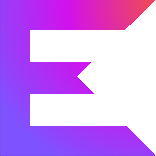

# RGB-rogue-like-game



## Краткое описание
_Software Design HW: rogue-like 2D game "RGB" with tile graphics_

Более подробно: TODO

**Ссылка на документацию:** TODO

[//]: # (https://glebsolovev.github.io/SD-2022/)

## Состояние разработки
На данный момент в проекте:
- реализован основной функционал (описано выше)
- настроен CI: запуск тестов и линтеров, сборка и публикация документации

[//]: # (`ARCHITECTURE.md` содержит подробное описание архитектуры)
[//]: # (задокументирован и покрыт тестами)

## Использование приложения
### Запуск
Сборка осуществляется при помощи Gradle из директории с проектом:
```bash
./gradlew run
```

### Альтернативные сборка и запуск
Альтернативный способ запуска приложения через Gradle:
```bash
./gradlew assemble
```
Собранный `RGB-rogue-like-game-1.0.jar` можно найти в директории `build/libs/`.

Чтобы его запустить, достаточно выполнить следующую команду из папки с проектом:
```bash
kotlin -cp build/libs/RGB-rogue-like-game-1.0.jar ru.hse.sd.rgb.MainKt
```

### Запуск тестов
Чтобы запустить тесты и получить по ним статистику:
```bash
./gradlew test
```
